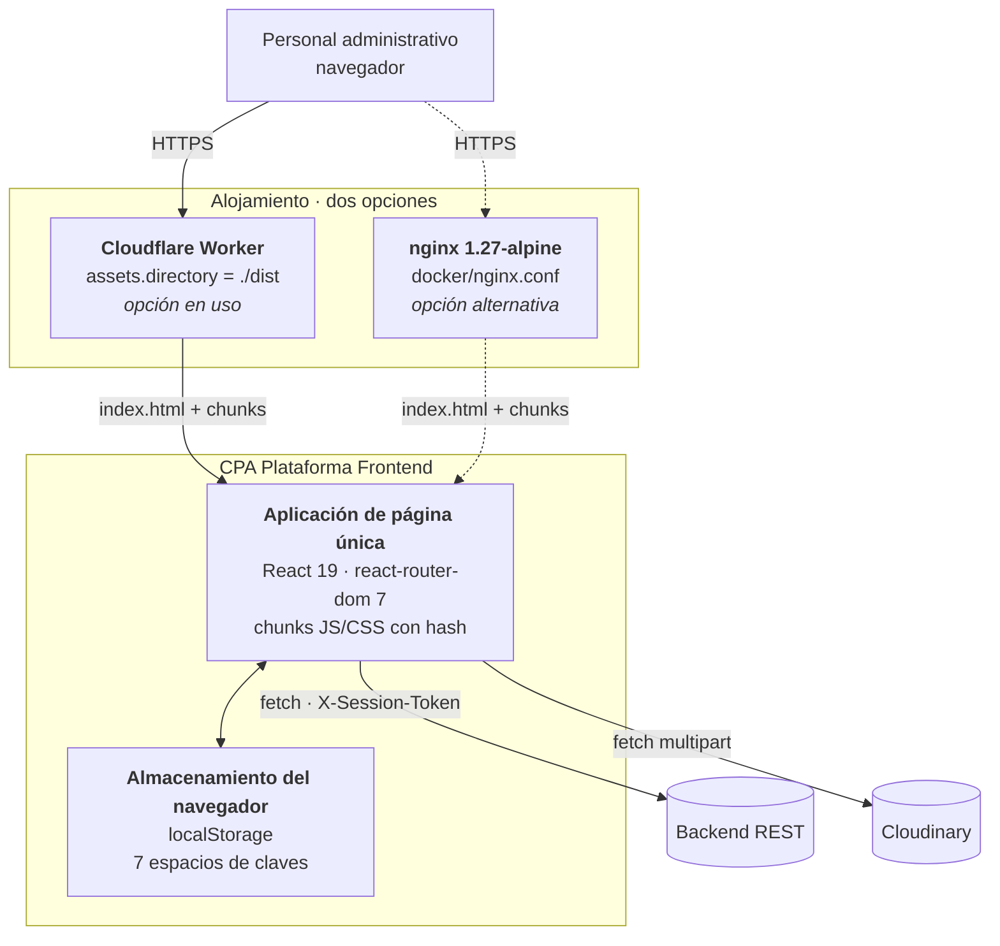
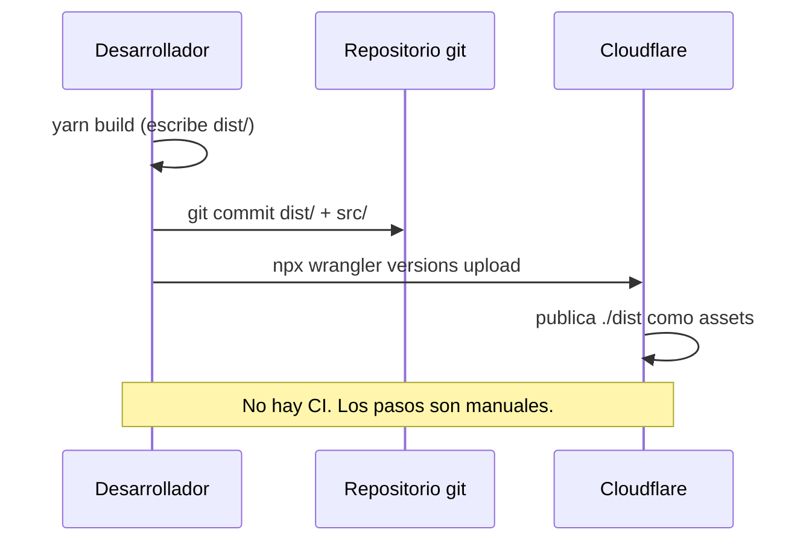

# C4 nivel 2 — Contenedores

## Diagrama



## Contenedores

### Aplicación de página única

| Aspecto | Valor |
|---|---|
| Tecnología | React 19.2.7, TypeScript 6, Vite 8 |
| Entrada | `index.html` → `/src/main.tsx` |
| Artefacto | 13 chunks JS + 12 CSS, con hash en el nombre |
| Peso | 865 KiB JS y 121 KiB CSS totales; **148 KiB gzip** en la carga inicial |
| Ejecución | Íntegramente en el navegador. Sin código de servidor |

Detalle por chunk: [performance/bundle-analysis.md](../performance/bundle-analysis.md).

### Almacenamiento del navegador

Todo el estado persistente vive en `localStorage`. **No se usan cookies, `sessionStorage` ni IndexedDB.**

| Espacio de claves | Contenido | Escrito por |
|---|---|---|
| `cpa.sessionToken`, `cpa_session_token` | Token de sesión (duplicado) | `shared/auth/session.ts:93` |
| `cpa.userEmail`, `cpa_user_email` | Correo (duplicado) | `session.ts:94` |
| `cpa.session` | Objeto de sesión completo en JSON, con roles y permisos | `session.ts:95` |
| `cpa.fileLibrary.folders.v1` | Carpetas de la biblioteca de archivos | `FileLibraryPage.tsx:146` |
| Claves de borrador | Borradores locales de formularios | `shared/services/localDraftStore.ts:59` |
| Progreso de tutoriales | Avance por tutorial | `LocalTutorialProgressStorage.ts:79` |
| Autoarranque de tutoriales | Preferencia booleana | `tutorialPreferences.ts:18` |

Duración: **indefinida**. No hay caducidad, ni limpieza programada, ni cifrado. La sesión solo se borra al pulsar «Cerrar sesión» o al recibir un `401`.

Análisis de riesgo: [security/browser-storage.md](../security/browser-storage.md).

### Alojamiento

Dos rutas de despliegue coexisten en el repositorio.

#### Cloudflare Worker — la que está en uso

```jsonc
// wrangler.jsonc
{ "name": "cpaplataformafrontend",
  "compatibility_date": "2026-08-04",
  "assets": { "directory": "./dist" } }
```

- No hay Worker con código: es un sitio estático, por eso se declara `assets.directory` y no `main`.
- Sirve **el `dist/` versionado en git**, no un build de CI.
- Publicación: `npx wrangler versions upload`. El archivo existe porque sin él wrangler abortaba con `Missing entry-point to Worker script or to assets directory` (documentado en sus propios comentarios).
- **No aplica cabeceras de seguridad**: sin CSP, sin `X-Frame-Options`, sin `Strict-Transport-Security`.

#### nginx en Docker — alternativa

`Dockerfile` (multietapa) + `docker/nginx.conf`:

| Regla | Efecto |
|---|---|
| `location /assets/` → `expires 1y; Cache-Control: public, immutable` | Caché larga, segura porque los nombres llevan hash |
| `location /` → `try_files $uri $uri/ /index.html` | Reescritura de SPA |
| `location = /index.html` → `no-cache, no-store, must-revalidate` | El despliegue nuevo se ve de inmediato |
| `gzip on` para texto, mínimo 1 024 B | Compresión |
| `HEALTHCHECK` con `wget` a `/` | Salud del contenedor |

Esta configuración es **más completa que la del Worker** en política de caché. Tampoco define CSP.

Comparativa y recomendaciones: [operations/deployment.md](../operations/deployment.md) y [operations/cache-and-cdn.md](../operations/cache-and-cdn.md).

## Flujo de despliegue actual



**Ausencia verificada:** no existe `.github/workflows/`, `.gitlab-ci.yml`, `Jenkinsfile` ni ningún otro pipeline en el repositorio. El script `ci:frontend` existe en `package.json` pero **nadie lo invoca automáticamente**.

Propuesta de pipeline (no implementada, requiere autorización): [operations/build.md](../operations/build.md) y [governance/change-management.md](../governance/change-management.md).

## Contenedores que NO existen

| Elemento | Verificación |
|---|---|
| Backend for Frontend (BFF) | El frontend habla directo con la API |
| Servidor de sesiones | La sesión vive en `localStorage` |
| Service Worker / PWA | Sin `manifest.json`, sin registro de SW |
| Caché de aplicación | Sin React Query ni almacén de datos |
| Worker de compilación en CI | Sin pipeline |
