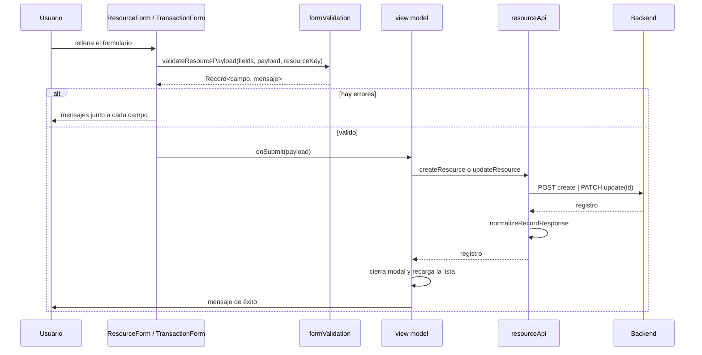
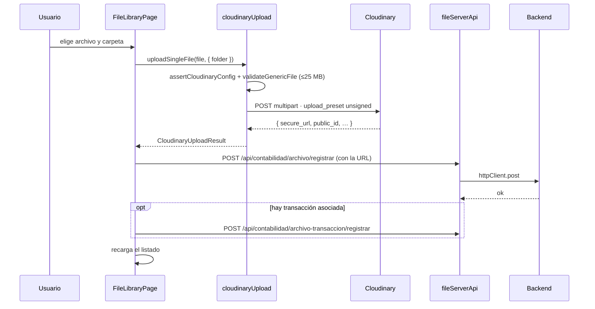

# Flujo de datos

## Recorrido completo de una lectura

```mermaid
sequenceDiagram
  autonumber
  participant U as Usuario
  participant VM as useResourceListViewModel
  participant API as resourceApi
  participant HC as httpClient
  participant ENV as config/env
  participant SES as shared/auth/session
  participant B as Backend
  participant MAP as resourceMapper

  U->>VM: cambia página / filtro / búsqueda
  VM->>VM: debounce 900 ms (búsqueda) u 800 ms (filtros)
  VM->>VM: construye ResourceListQuery
  alt sin búsqueda ni filtros
    VM->>API: listResource(resource, query)
  else con búsqueda o filtros
    VM->>API: listAllResource(...) · páginas de 200, tope 50 000
  end
  API->>API: appendQuery → duplica parámetros
  API->>HC: httpClient.get(url)
  HC->>ENV: assertEnv()
  ENV-->>HC: apiBaseUrl (o lanza excepción)
  HC->>SES: getSessionToken()
  SES-->>HC: token de localStorage
  HC->>B: fetch(baseUrl + path, { X-Session-Token })
  B-->>HC: Response
  HC->>HC: parseResponse · 204 → undefined; JSON → json(); resto → text()
  alt respuesta no OK
    HC->>HC: resolveErrorMessage + sanitizeTechnicalPaths
    opt status 401
      HC->>SES: clearStoredSession()
    end
    HC-->>VM: throw HttpError
    VM->>U: PageState de error con «Reintentar»
  else respuesta OK
    HC-->>API: payload
    API->>MAP: normalizeListResult(payload)
    MAP-->>API: { records, count, limit, offset, page }
    API-->>VM: resultado normalizado
    opt hay filtros activos
      VM->>VM: applyLocalQuery · filtra, ordena y pagina en el navegador
    end
    VM->>U: DataTable + paginación
  end
```

## Las cuatro transformaciones del dato

### 1. Construcción de la consulta — `appendQuery`

`resourceApi.ts:41-74`. Un mismo valor se envía con varios nombres para tolerar variantes del backend:

| Concepto | Parámetros emitidos |
|---|---|
| Paginación | `page`, `limit`, `offset` |
| Orden | `orderBy`, `orderDir` |
| Búsqueda | `q`, `search`, `term` |
| Visibilidad | `onlyActivos`, `only_activos`, `includeInactive`, `include_inactive` |
| Cada filtro | `<clave>` y `filter_<clave>` |

**Regla de visibilidad** (`resolveOnlyActiveFilter`, líneas 21-28): salvo que el usuario haya pedido explícitamente «Activo», se piden **todos** los estados. El comentario del código explica el porqué: muchas funciones del sistema tienen `p_only_activos DEFAULT true`, y sin esto los registros inactivos serían invisibles aunque el usuario no hubiera filtrado.

**Heurística adicional** (líneas 57-63): si no hay búsqueda pero hay **exactamente un** filtro de texto, ese valor se envía además como `q`/`search`. Es un atajo que puede sorprender: un filtro por una columna concreta se convierte también en búsqueda global.

### 2. Normalización de la respuesta — `normalizeListResult`

`resourceMapper.ts:25-74`. Busca la lista, en orden, en:

```
response (si es array)
→ response.rows | .items | .results | .records | .data
→ response.data.rows | .items | .results | .records | .detalle
```

Y la paginación en `meta` → `pagination` → `paging`, aceptando `limit`/`pageSize`, `offset`, `count`/`total`, `page`.

Si nada coincide devuelve `{ rows: [], meta: response }`: **una respuesta con forma desconocida se convierte en lista vacía, no en error**. La interfaz mostrará «Sin registros» en lugar de avisar de un problema de contrato.

Es la característica más importante —y más arriesgada— del flujo de datos. Ver [integrations/backend-api.md](../integrations/backend-api.md).

### 3. Filtrado local — `applyLocalQuery`

`useResourceListViewModel.ts:358-371`. Solo cuando hay consulta activa:

```ts
allRecords
  .filter(recordMatchesSearch)   // busca en TODOS los valores del registro
  .filter(recordMatchesFilters)  // por columna
  .sort(compareRecords)          // numérico o localeCompare('es')
  .slice(offset, offset + limit)
```

Reglas de coincidencia (`recordMatchesFilters`, líneas 311-333):

| Tipo de dato | Comparación |
|---|---|
| Booleano en el registro | El texto del filtro se traduce a booleano con `statusTextToBoolean` |
| Campo tipo `id_*` o valor numérico | **Exacta**, para evitar coincidencias accidentales |
| Texto | **Contiene**, sin acentos ni mayúsculas (`normalizeForCompare`) |

`statusTextToBoolean` (líneas 305-309) existe porque el estado se guarda como texto en unas tablas y como booleano en otras; sin la traducción, filtrar «Activo» sobre `persona_estudiante` devolvía cero resultados. El comentario del código lo documenta.

### 4. Selección de columnas

`columnRank` (líneas 58-64) ordena las columnas y `MAX_TABLE_COLUMNS = 14` recorta. Prioridad: nombre → código → estado → operativo; auditoría al final.

## Flujo de escritura



`normalizeRecordResponse` (`resourceMapper.ts:76-80`): devuelve `response.data` si existe, si no la propia respuesta, si no `{}`.

**Sin actualización optimista y sin rollback**: la interfaz espera siempre la respuesta. Es coherente con datos contables.

## Flujo de borradores

Dos vías coexisten:

| Vía | Servicio | Almacenamiento |
|---|---|---|
| Local | `shared/services/localDraftStore.ts` | `localStorage` |
| Remota | `persistentDraftApi.ts` **y** `backendDraftApi.ts` | `POST/PATCH /api/administracion/registro-borrador` |

Los dos servicios remotos apuntan al mismo endpoint y ofrecen la misma superficie (línea 27 en ambos): **duplicación confirmada**. Ver [module-dependencies.md](module-dependencies.md#código-huérfano-y-duplicado).

## Flujo de archivos: el que no pasa por el backend



> **Sin atomicidad.** Si Cloudinary acepta el archivo y el registro en el backend falla, el binario queda huérfano en el tercero. No hay compensación ni reintento. Ver [routes/file-library.md](../routes/file-library.md).

## Puntos de fallo del flujo

| # | Punto | Comportamiento | Visibilidad |
|---|---|---|---|
| 1 | `assertEnv()` | Lanza excepción antes de cualquier fetch | Error en pantalla |
| 2 | Red caída | `fetch` rechaza; el hook captura | `PageState` + «Reintentar» |
| 3 | Respuesta no OK | `HttpError` con mensaje saneado | `PageState` |
| 4 | `401` | Además borra la sesión | Expulsión en la siguiente navegación |
| 5 | **Respuesta con forma desconocida** | `normalizeListResult` devuelve lista vacía | ⚠️ **«Sin registros», indistinguible de que no haya datos** |
| 6 | Fallo de un lookup | `catch` devuelve `[]` | ⚠️ Silencioso: el select queda vacío sin explicación |
| 7 | Fallo en `Promise.all` de catálogos | Rechaza el conjunto | Pantalla entera en error |
| 8 | Fallo de Cloudinary | Excepción con mensaje | Mensaje en pantalla |
| 9 | Fallo del progreso de tutoriales | Degrada a `localStorage` + `console.warn` | ✅ Único con degradación diseñada |

Los puntos **5** y **6** son fallos silenciosos: la interfaz muestra un estado normal ante un problema real. Clasificados HIGH en [reports/documentation-gap-analysis.md](../reports/documentation-gap-analysis.md).

## Saneado de mensajes de error

`sanitizeTechnicalPaths` (`httpClient.ts:40-48`) reescribe el mensaje del backend antes de mostrarlo:

| Patrón | Sustitución |
|---|---|
| `https?://…` | `servicio interno` |
| `GET/POST/PUT/PATCH/DELETE /ruta` | `acción del sistema` |
| `/api/…` | `servicio interno` |
| `endpoint` | `servicio` |
| `ruta` | `opción` |

Evita filtrar topología interna al usuario final. **Efecto secundario:** también dificulta el diagnóstico, porque el mensaje que ve el usuario no permite identificar el endpoint. El objeto `HttpError` conserva `details` con el payload original, pero **nadie lo registra**. Ver [observability/error-reporting.md](../observability/error-reporting.md).
