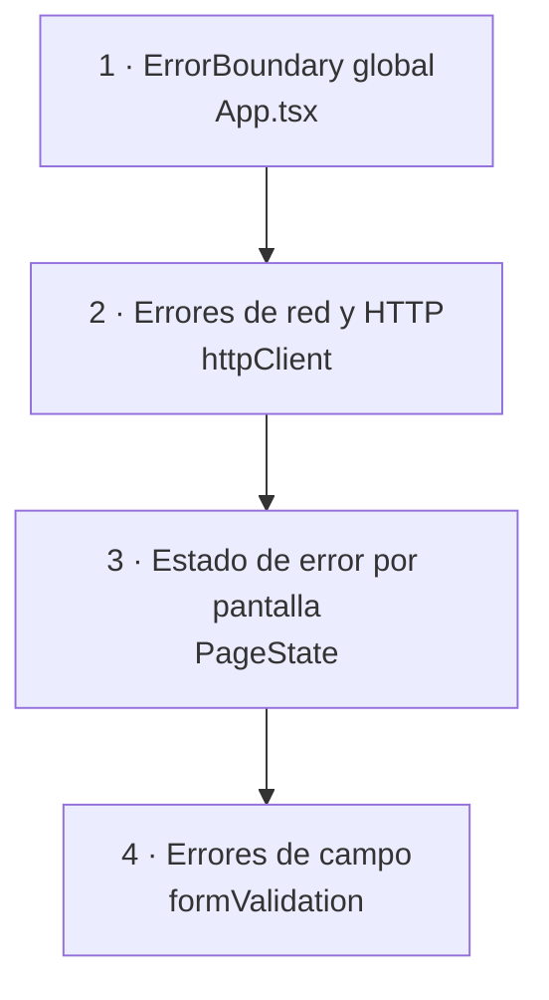

# Manejo de errores y límites de error

## Los cuatro niveles



## Nivel 1 — `ErrorBoundary` global

`src/shared/components/ErrorBoundary/ErrorBoundary.tsx`, montado en `App.tsx` por encima del `RouterProvider`: **cubre toda la aplicación, incluido el router**.

```tsx
static getDerivedStateFromError(): ErrorBoundaryState { return { hasError: true }; }

componentDidCatch(error: Error, info: ErrorInfo): void {
  // Evita pantalla blanca en producción y deja evidencia en consola para depuración local.
  console.error('Error no controlado en CPA Frontend', error, info);
}
```

Interfaz de recuperación: «Algo se desajustó», con el texto «La pantalla tuvo un error inesperado. No se perdió tu sesión», y dos acciones:

| Acción | Implementación |
|---|---|
| Recargar pantalla | `window.location.reload()` |
| Ir al inicio | `window.location.href = '/'` |

Usa `window.location` y no el router porque, tras un error de render, el árbol de React puede estar inconsistente. Es la decisión correcta.

### Limitaciones reales

| Limitación | Consecuencia |
|---|---|
| **Es el único límite de error** | No hay `ErrorBoundary` por ruta ni por sección. Un fallo en una tabla tumba la aplicación entera |
| **No se reinicia solo** | `hasError` nunca vuelve a `false`. La única salida es recargar o navegar por `window.location` |
| **No captura errores asíncronos** | Los límites de React solo capturan errores de render, ciclo de vida y constructores. Un `throw` dentro de un `setTimeout` o de una promesa sin `catch` **no llega aquí** |
| **No se envía a ningún sitio** | Solo `console.error`. Sin Sentry ni servicio equivalente: **nadie sabe cuántos usuarios ven esta pantalla** |
| **Sin identificador de incidente** | El usuario no puede aportar un código al reportar |
| **Sin `errorElement` del router** | Los errores del router también acaban aquí, sin contexto de ruta |

## Nivel 2 — Errores de red y HTTP

`httpClient.ts` centraliza todo el tratamiento.

### Clase de error

```ts
export class HttpError extends Error {
  constructor(message: string, public readonly status: number, public readonly details?: unknown)
}
```

`details` conserva el payload original del backend. **Ningún consumidor lo lee**: se pierde. Ver [observability/error-reporting.md](../observability/error-reporting.md).

### Mensajes por defecto

`fallbackErrorMessage` (líneas 50-57):

| Código | Mensaje al usuario |
|---|---|
| 400 | La solicitud no pudo procesarse. Revisa los datos ingresados. |
| 401 | Tu sesión expiró o no es válida. Vuelve a iniciar sesión. |
| 403 | No tienes permisos para realizar esta acción. |
| 404 | La información solicitada no está disponible. |
| ≥ 500 | El servicio no está disponible en este momento. Intenta nuevamente. |
| otros | No se pudo completar la operación. Código {status}. |

Están en español, sin jerga técnica y son accionables. Es un punto fuerte del proyecto.

### Preferencia por el mensaje del backend

`resolveErrorMessage` (líneas 59-71) usa `payload.message` si existe, saneado con `sanitizeTechnicalPaths` (ver [data-flow.md](data-flow.md#saneado-de-mensajes-de-error)). Si tras sanear queda vacío, cae al mensaje por defecto.

### Efecto secundario del `401`

```ts
if (response.status === 401) clearStoredSession();
```

Presente en `request` (línea 104) y en `upload` (línea 133). Borra las 5 claves de sesión. El usuario **no** es expulsado en ese momento; lo será en la siguiente navegación protegida.

### Lo que NO hace

| Ausencia | Impacto |
|---|---|
| Reintentos | Un fallo de red transitorio es definitivo |
| Retroceso exponencial | — |
| Tiempo de espera | **Sin `timeout`**: una petición colgada lo está indefinidamente. El único límite es el del navegador |
| Cancelación | Sin `AbortController` |
| Interceptor de refresco de token | No hay renovación de sesión |

## Nivel 3 — Estado de error por pantalla

Patrón dominante:

```tsx
{viewModel.error
  ? <PageState title="No se pudo completar la operación"
               message={viewModel.error}
               actionLabel="Reintentar"
               onAction={() => void viewModel.load()} />
  : null}
```

| Pantalla | Estado de error | Acción de recuperación |
|---|---|---|
| `ResourceListPage` | ✅ | Reintentar |
| `UserProfilePage` | ✅ | Reintentar |
| `CatalogosOperativosPage` | ✅ | Reintentar |
| `TutorialCenterPage` | ✅ | — |
| `FileLibraryPage` | ✅ | — |
| `ResourceBatchPage` | ✅ | — |
| `LoginPage` | ✅ (`role="alert"`) | Reenviar |
| `ModuleResourcePickerPage` | n/a (sin datos) | — |
| `HomePage` | n/a (sin datos) | — |

Cobertura completa de las pantallas con datos. **Solo tres ofrecen acción de reintento.**

## Nivel 4 — Errores de campo

`shared/validation/formValidation.ts` devuelve `Record<nombreCampo, mensaje>`; `FormField` los pinta como `<small className={styles.error}>` bajo el control.

**Un error por campo:** `addError` no sobrescribe el primero, y el bucle usa `continue` tras cada fallo. Si un campo incumple dos reglas, el usuario ve la primera, corrige, reenvía y descubre la segunda.

Detalle de reglas: [data-and-state/forms-and-validation.md](../data-and-state/forms-and-validation.md).

## Errores silenciosos — el punto débil

| # | Ubicación | Comportamiento | Por qué importa |
|---|---|---|---|
| 1 | `useResourceListViewModel.ts:425` — carga de lookups | `catch { return [field.name, []] }` | Un select queda **vacío sin explicación**. El usuario cree que no hay opciones |
| 2 | `resourceMapper.ts:42` — forma desconocida | Devuelve `{ rows: [], meta }` | Se muestra «Sin registros»: **indistinguible de una tabla realmente vacía** |
| 3 | `useResourceListViewModel.ts:132` — enriquecer transacción | `catch { return record }` | Se edita una transacción **sin sus movimientos**, en silencio |
| 4 | `session.ts:61` — sesión corrupta | `catch { return null }` | Se trata como «sin sesión»: redirige a login sin decir por qué |
| 5 | `cloudinaryUpload.ts:81` — respuesta no JSON | `body = null` | Deriva a un mensaje genérico |

Los tres primeros **muestran un estado normal ante un fallo real**. Clasificados HIGH en [reports/documentation-gap-analysis.md](../reports/documentation-gap-analysis.md).

## El contraejemplo positivo: tutoriales

`ResilientTutorialProgressStorage` es el único componente con estrategia de degradación explícita:

1. Intenta el almacén remoto.
2. Si falla, usa `localStorage`.
3. Emite `progress-sync-failed`, que **siempre** se registra con `console.warn`, también en producción, por decisión comentada en `tutorialAnalytics.ts:47-48`:

> «Los fallos se registran siempre (también en producción): un tutorial que apunta a un elemento inexistente es un defecto que hay que poder ver, no silenciar.»

Ese criterio, aplicado al resto del frontend, resolvería los cinco fallos silenciosos anteriores.

## Recomendaciones (propuestas, no ejecutadas)

| # | Propuesta | Nivel |
|---|---|---|
| 1 | Registrar `HttpError.details` en consola antes de descartarlo | 2 |
| 2 | Diferenciar «lista vacía» de «respuesta no reconocida» en `normalizeListResult` | 2 |
| 3 | Mostrar aviso cuando un lookup falla, en vez de un select vacío | 3 |
| 4 | Añadir `ErrorBoundary` por ruta con `errorElement` | 1 |
| 5 | Añadir `timeout` a `fetch` mediante `AbortSignal.timeout` | 2 |
| 6 | Enviar los errores capturados a un servicio remoto | 1 |

Todas modifican `src/` y requieren autorización.
