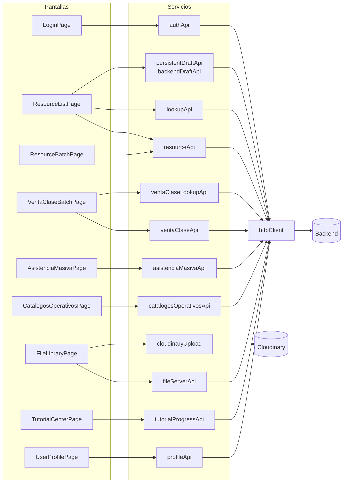

# Mapa de integraciones

Trazabilidad pantalla ↔ servicio ↔ endpoint ↔ prueba. Regenerable con `node scripts/check-api-contract-drift.mjs`.

## Vista general



## Tabla de trazabilidad

| Pantalla | Servicio | Endpoint | Método | Prueba |
|---|---|---|---|---|
| `LoginPage` | `authApi` | `/api/auth/publicAuth/login` | POST | ❌ |
| `UserProfilePage` | `profileApi` | `/api/auth/privateAuth/me` | GET | ❌ |
| `ResourceListPage` | `resourceApi` | `{resource.endpoints.list}` | GET | ⚠️ solo el mapper (3 casos) |
| `ResourceListPage` | `resourceApi` | `{resource.endpoints.detail(id)}` | GET | ❌ |
| `ResourceListPage` | `resourceApi` | `{resource.endpoints.create}` | POST | ❌ |
| `ResourceListPage` | `resourceApi` | `{resource.endpoints.update(id)}` | PATCH | ❌ |
| `ResourceListPage` | `lookupApi` | `{field.relation.endpoint}` | GET | ❌ |
| `ResourceListPage` | `persistentDraftApi` / `backendDraftApi` | `/api/administracion/registro-borrador` | GET/POST/PATCH | ❌ |
| `ResourceBatchPage` | `resourceApi` | `{list}/batch/validate` | POST multipart | ❌ |
| `ResourceBatchPage` | `resourceApi` | `{list}/batch/process` | POST multipart | ❌ |
| `VentaClaseBatchPage` | `ventaClaseApi` | `/api/contabilidad/venta-clase/registrar-batch` | POST | ❌ |
| `VentaClaseBatchPage` | `ventaClaseLookupApi` | `/api/personas/estudiante` | GET | ❌ |
| `VentaClaseBatchPage` | `ventaClaseLookupApi` | `/api/personas/tutor` | GET | ❌ |
| `VentaClaseBatchPage` | `ventaClaseLookupApi` | `/api/infraestructura/aula` | GET | ❌ |
| `VentaClaseBatchPage` | `ventaClaseLookupApi` | `/api/servicios_educativos/materia-tree` | GET | ❌ |
| `VentaClaseBatchPage` | `ventaClaseLookupApi` | `/api/servicios_educativos/producto-educativo` | GET | ❌ |
| `AsistenciaMasivaPage` | `asistenciaMasivaApi` | `/api/servicios_educativos/asistencia-clase-curso` | GET/POST/PUT | ❌ |
| `AsistenciaMasivaPage` | `asistenciaMasivaApi` | `/api/servicios_educativos/clase-curso?limit=100&orderBy=fecha&orderDir=DESC` | GET | ❌ |
| `AsistenciaMasivaPage` | `asistenciaMasivaApi` | `/api/servicios_educativos/inscripcion-curso?…` | GET | ❌ |
| `AsistenciaMasivaPage` | *(inline en la página)* | `/api/personas/estudiante` | GET | ❌ |
| `CatalogosOperativosPage` | `catalogosOperativosApi` | `/api/contabilidad/cuenta` | GET | ❌ |
| `CatalogosOperativosPage` | `catalogosOperativosApi` | `/api/contabilidad/configuracion-cuenta-operativa` | GET/POST | ❌ |
| `CatalogosOperativosPage` | `catalogosOperativosApi` | `/api/contabilidad/configuracion-cuenta-operativa/{id}` | PATCH | ❌ |
| `CatalogosOperativosPage` | `catalogosOperativosApi` | `/api/servicios_educativos/materia-tree` | GET | ❌ |
| `CatalogosOperativosPage` | `catalogosOperativosApi` | `/api/servicios_educativos/producto-educativo` | GET | ❌ |
| `CatalogosOperativosPage` | `catalogosOperativosApi` | `/api/personas/unidad-educativa` | GET | ❌ |
| `FileLibraryPage` | `fileServerApi` | `/api/contabilidad/archivo?{query}` | GET | ❌ |
| `FileLibraryPage` | `fileServerApi` | `/api/contabilidad/archivo/registrar` | POST | ❌ |
| `FileLibraryPage` | `fileServerApi` | `/api/contabilidad/archivo-transaccion/registrar` | POST | ❌ |
| `FileLibraryPage` | `cloudinaryUpload` | `api.cloudinary.com/v1_1/{cloud}/auto/upload` | POST | ❌ |
| `CloudinaryUploadField` | `cloudinaryUpload` | `api.cloudinary.com/v1_1/{cloud}/image/upload` | POST | ❌ |
| `TutorialCenterPage` | `tutorialProgressApi` | `/api/onboarding/tutoriales/progreso` | GET/DELETE | ⚠️ indirecta |
| `TutorialCenterPage` | `tutorialProgressApi` | `/api/onboarding/tutoriales/progreso/{id}` | PUT/DELETE | ⚠️ indirecta |

**Cobertura de contrato: 0 pruebas directas de integración.** Ninguna prueba ejercita `httpClient` ni un servicio real.

## Anomalías detectadas

| # | Anomalía | Detalle | Severidad |
|---|---|---|---|
| A-01 | **Endpoints de batch sin declarar** | Ningún recurso declara `batchValidate`/`batchProcess`; se usa siempre `{list}/batch/validate` y `/process`. Sin evidencia de que existan en el backend | CRITICAL |
| A-02 | **Recurso `aula` inexistente** | `ventaClaseLookupApi.ts:190` consulta `/api/infraestructura/aula`, pero **no hay ningún recurso `aula`** entre los 59 de `resourceDefinitions`. En infraestructura existe `espacio` con `tipo: AULA`. `ResourceListPage.tsx:56` también menciona `resource.key === 'aula'` para el coloreado por hora, una condición que nunca se cumple | HIGH |
| A-03 | **Servicios de borrador duplicados** | `persistentDraftApi` y `backendDraftApi` apuntan al mismo endpoint con la misma superficie | MEDIUM |
| A-04 | **Endpoint inline en una página** | `AsistenciaMasivaPage.tsx:21` contiene el literal `/api/personas/estudiante`, saltándose la capa de servicios | LOW |
| A-05 | **Singular vs. plural en archivos** | El recurso CRUD es `/api/contabilidad/archivos-transaccion`; `FileLibraryPage` usa `/api/contabilidad/archivo-transaccion/registrar`. Rutas distintas | MEDIUM |
| A-06 | **Endpoints fuera del catálogo CRUD** | `configuracion-cuenta-operativa`, `archivo`, `archivo/registrar`, `archivo-transaccion/registrar`, `registro-borrador` y `onboarding/tutoriales/progreso` no están en `resourceDefinitions` | Informativo |

## Integraciones que NO existen

| Tipo | Estado |
|---|---|
| WebSockets | ❌ `grep -rn "WebSocket" src` → sin resultados |
| Server-Sent Events | ❌ `EventSource` sin uso |
| Polling | ❌ Sin `setInterval` para datos |
| GraphQL | ❌ |
| Pasarela de pagos | ❌ |
| Correo / notificaciones push | ❌ |
| Mapas | ❌ Hay campos `latitud`/`longitud` pero **ningún componente de mapa** |
| Servicio de analítica | ❌ |
| Captura de errores remota | ❌ |

## Integraciones con terceros

| Servicio | Uso | Autenticación | Riesgo |
|---|---|---|---|
| **Cloudinary** | Subida directa desde el navegador | Unsigned preset público | Alto: subida sin sesión. Ver [security/threat-model.md](../security/threat-model.md#t-06) |
| **cdnjs.cloudflare.com** | CSS de FontAwesome | Ninguna | Medio: sin SRI, sin CSP. Ver [security/dependencies.md](../security/dependencies.md) |

## Cómo verificar el mapa

```bash
# Endpoints literales del código
grep -rnoE "'/api/[^']*'|\`/api/[^\`]*\`" src --include="*.ts" --include="*.tsx" | sort -u

# Llamadas al cliente HTTP
grep -rn "httpClient\.\(get\|post\|put\|patch\|delete\|upload\)" src --include="*.ts"

# Contraste automático contra este documento
node scripts/check-api-contract-drift.mjs
```
