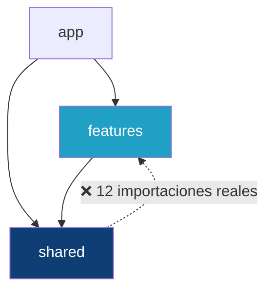
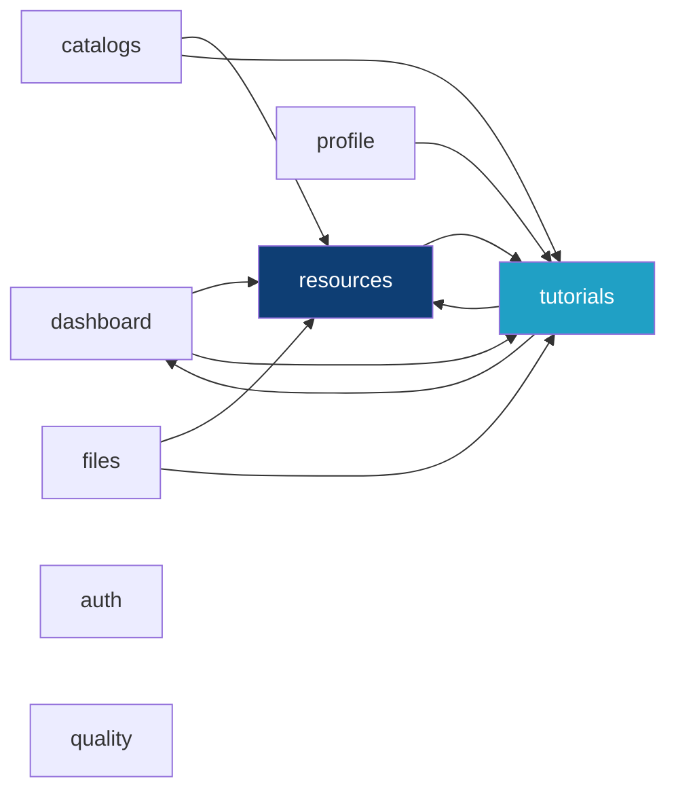

# Dependencias entre módulos

> Derivado de la [auditoría Graphify](../reports/graphify-audit.md) (988 nodos, 2 522 aristas) y verificado con análisis estático reproducible sobre el commit `618e5c3`.

## Comandos de verificación

Todo lo afirmado aquí se reproduce con:

```bash
# Violación shared → features
grep -rn "from '@/features" src/shared --include="*.ts" --include="*.tsx"

# Dependencias entre features
for f in $(grep -rl "from '@/features" src/features --include="*.ts" --include="*.tsx"); do
  own=$(echo $f | cut -d/ -f3)
  grep -o "from '@/features/[a-z]*" $f | sed "s|from '@/features/||" | while read dep; do
    [ "$dep" != "$own" ] && echo "$own -> $dep ($f)"
  done
done | sort -u

# Uso de shared desde features
grep -rho "from '@/shared/[a-z]*" src/features | sort | uniq -c | sort -rn
```

## Dirección de dependencia esperada vs. real



## Violación `shared` → `features` {#violación-shared--features}

**12 importaciones** rompen la regla. Se agrupan en tres causas distintas, con distinto peso:

### Causa 1 — Anclajes de tutorial (4 archivos)

```
shared/components/SearchFilterBar/SearchFilterBar.tsx:3 → features/tutorials/domain/tutorialAnchors
shared/components/DataTable/DataTable.tsx:2             → features/tutorials/domain/tutorialAnchors
shared/components/Modal/Modal.tsx:4                      → features/tutorials/domain/tutorialAnchors
shared/layouts/AppShell/AppShell.tsx:7                   → features/tutorials/domain/tutorialAnchors
```

Los tutoriales guiados necesitan apuntar a elementos concretos del DOM. `tutorialAnchor()` genera atributos `data-*` que los componentes compartidos deben emitir. Al vivir el contrato de anclajes dentro de la feature, los componentes compartidos dependen de ella.

**Es una dependencia de valores en tiempo de ejecución**, no solo de tipos: la función se ejecuta en el render.

| Opción de corrección | Coste | Riesgo |
|---|---|---|
| Mover `tutorialAnchors` a `shared/tutorials/anchors.ts` | Bajo: es un módulo de constantes puras | Toca 15 importaciones; sin cambio de comportamiento |
| Pasar los anclajes por props desde las páginas | Alto: cambia la API de 4 componentes compartidos | Cambio de producto |
| Aceptar y documentar | Cero | La regla queda como aspiración |

**Recomendación:** la primera. Es la única de coste bajo y sin efecto observable. **No se ha ejecutado**: mover archivos de `src/` es un cambio de producto y requiere autorización. Ver [reports/documentation-gap-analysis.md](../reports/documentation-gap-analysis.md).

### Causa 2 — `AppShell` conoce el dominio (3 importaciones)

```
AppShell.tsx:3  → features/dashboard/moduleMeta        (iconos y descripciones de módulo)
AppShell.tsx:6  → features/resources/domain/resourceDefinitions  (resourceModules)
AppShell.tsx:8  → features/tutorials/domain/tutorialRoutes
AppShell.tsx:9  → features/tutorials/react/TutorialLauncher
AppShell.tsx:10 → features/tutorials/react/TutorialProvider
```

`AppShell` construye la barra lateral a partir de los 59 recursos y monta el proveedor de tutoriales. **Es un layout de aplicación, no un componente genérico.**

**Diagnóstico:** el archivo está mal ubicado. `AppShell` pertenece a `app/`, no a `shared/`. Ahí las importaciones dejarían de ser una violación: `app/` sí puede depender de todo.

### Causa 3 — Tipos de dominio compartidos (3 importaciones, solo tipos)

```
shared/components/SearchFilterBar/SearchFilterBar.tsx:1 → type ResourceTableFilter
shared/validation/formValidation.ts:1                   → type CrudRecord, ResourceFieldDefinition
shared/services/localDraftStore.ts:1                    → type CrudRecord
```

Son `import type`: **se borran en compilación y no generan dependencia en el bundle**. El acoplamiento es de diseño, no de ejecución.

La causa de fondo es que `CrudRecord` y `CrudResourceDefinition` son tipos **de aplicación**, no de la feature `resources`: los usa todo el sistema. Su sitio natural sería `shared/domain/`.

## Dependencias entre features



| Origen | Destino | Archivos | Naturaleza |
|---|---|---|---|
| `dashboard` | `resources` | `ModuleSummary`, `ModuleResourcePickerPage` | Lee `resourceModules` |
| `dashboard` | `tutorials` | `ModuleSummary`, `HomePage`, `ModuleResourcePickerPage` | Anclajes y lanzador |
| `catalogs` | `resources` | `catalogosOperativosApi` | Reutiliza tipos/servicios |
| `catalogs` | `tutorials` | `CatalogosOperativosPage` | Anclajes |
| `files` | `resources` | `fileServerApi` | Reutiliza tipos |
| `files` | `tutorials` | `FileLibraryPage` | Anclajes |
| `profile` | `tutorials` | `UserProfilePage` | Anclajes |
| `resources` | `tutorials` | `ResourceForm`, `ResourceHeader`, `ResourceBatchPage`, `ResourceListPage` | Anclajes y lanzador |
| `tutorials` | `dashboard` | `TutorialCenterPage` | `getModuleVisualMeta` |
| `tutorials` | `resources` | `tutorialRoutes.ts` | `findResourceDefinition`, `findResourceModule` |

`auth` y `quality` no dependen de ninguna otra feature.

### Ciclos

| Nivel | Resultado |
|---|---|
| **Archivo** | ✅ **Sin ciclos.** Graphify reportó `self_loop_edges: 0` y no se detectaron componentes fuertemente conexos |
| **Feature** | ❌ **Dos ciclos**: `dashboard ↔ tutorials` y `resources ↔ tutorials` |

Los ciclos de feature no rompen el build ni el bundling —el grafo de archivos sigue siendo acíclico—, pero significan que **ninguna de esas tres features puede extraerse ni probarse de forma aislada**.

`tutorials` es el nodo central del enredo: aparece en 8 de las 10 aristas.

## Duplicación de la fuente de verdad: rutas

`features/tutorials/domain/tutorialRoutes.ts` mantiene una **copia manual** de las rutas:

```ts
/**
 * Rutas reales de la aplicación (espejo de `src/app/router.tsx`).
 * Se mantiene aquí como lista de patrones para que el validador de tutoriales pueda
 * detectar rutas inexistentes sin arrastrar el router (y su carga perezosa) a las pruebas.
 */
export const APP_ROUTE_PATTERNS = [ '/', '/login', '/tutoriales', … ] as const;
```

| Aspecto | Evaluación |
|---|---|
| Motivo | Legítimo y bien argumentado: evita arrastrar el router perezoso a las pruebas |
| Riesgo | **Drift.** Añadir una ruta a `router.tsx` sin actualizar esta lista hace que la validación de tutoriales la rechace |
| Mitigación existente | `tutorialValidation.test.ts` (12 casos) comprueba las rutas de los tutoriales contra esta lista, **pero no comprueba esta lista contra `router.tsx`** |
| Estado actual | ✅ Las 9 rutas coinciden con el router |

Cubierto por `scripts/check-doc-coverage.mjs`, que compara ambas fuentes. Ver [governance/traceability-matrix.md](../governance/traceability-matrix.md).

## Nodos de alta centralidad y su riesgo

| Nodo | Grado | Riesgo si cambia | Pruebas |
|---|---:|---|---:|
| `TutorialEngine` | 38 | Alto, contenido en la feature | 28 |
| `TutorialDefinition` | 37 | Alto, contenido | — |
| `tutorialAnchor` | 35 | **Atraviesa capas**: tocarlo afecta a `shared` | indirectas |
| `CrudRecord` | 22 | **Transversal**: 4 features + `shared` | 0 |
| `CrudResourceDefinition` | 21 | **Transversal** | 0 |
| `normalizeListResponse()` | 18 | Alto: única puerta de entrada de datos de lista | 3 |

Los tres nodos transversales con más riesgo real de negocio (`CrudRecord`, `CrudResourceDefinition`, `normalizeListResponse`) suman **3 casos de prueba**.

## Uso de `shared` desde `features`

| Módulo compartido | Importaciones |
|---|---:|
| `shared/components` | 30 |
| `shared/api` | 12 |
| `shared/utils` | 9 |
| `shared/services` | 6 |
| `shared/auth` | 6 |
| `shared/validation` | 1 |

Solo **una** feature importa `shared/validation`, pese a que el archivo contiene 341 líneas con reglas de siete recursos distintos. Confirma que su ubicación en `shared` no responde a reutilización real. Ver [frontend-layers.md](frontend-layers.md#excepción-notable-formvalidation-en-shared).

## Código huérfano y duplicado

| Elemento | Tipo | Acción propuesta |
|---|---|---|
| `features/quality/pages/QualityGatePage.tsx` + CSS | Huérfano, 0 importaciones | Eliminar (cambio de producto) |
| `persistentDraftApi.ts` / `backendDraftApi.ts` | Duplicado: mismo endpoint `/api/administracion/registro-borrador`, misma superficie | Unificar (cambio de producto) |
| `normalizeOption()` y `renderFilterInput()` | Duplicados en `SearchFilterBar` y `ResourceExportModal` | Extraer a un módulo común |
| FontAwesome | Doble carga: CDN + npm | Elegir una vía |

Ninguna de estas acciones se ha ejecutado: todas modifican `src/`. Registradas en [reports/documentation-gap-analysis.md](../reports/documentation-gap-analysis.md) como propuestas pendientes de autorización.
