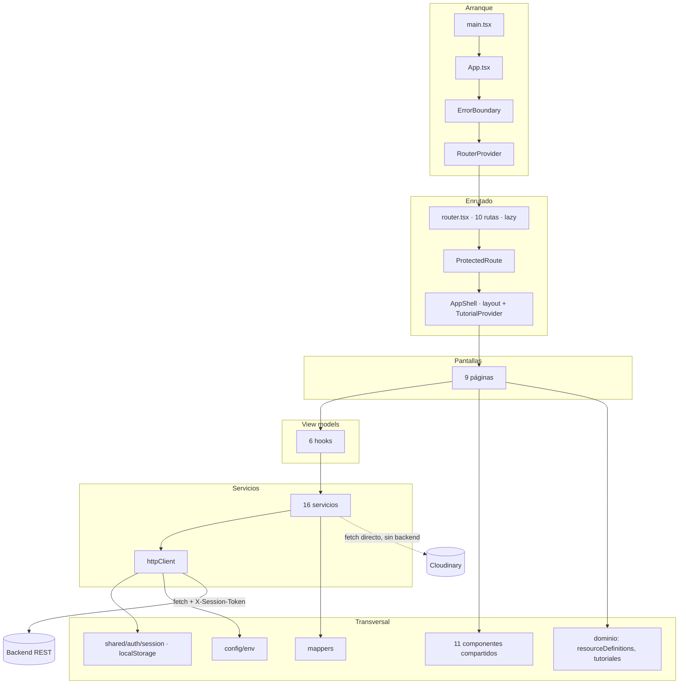
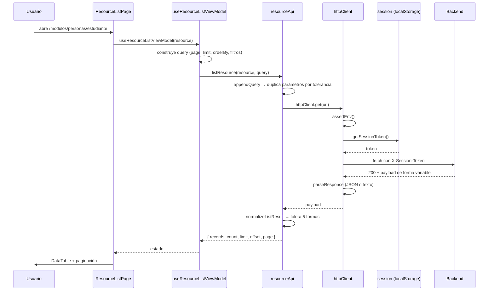

# Visión general de la arquitectura

> Descripción del sistema **tal como está construido** en el commit `618e5c3`, contrastada con la [auditoría Graphify](../reports/graphify-audit.md).

## Idea central en una frase

Es una **SPA de React 100 % cliente** cuyo núcleo es un **motor CRUD genérico dirigido por datos**: una sola pantalla (`ResourceListPage`) y un solo hook (`useResourceListViewModel`) sirven 59 recursos de negocio, configurados declarativamente en `resourceDefinitions.ts`.

## Las cinco decisiones que explican todo lo demás

| # | Decisión | Consecuencia observable | ADR |
|---|---|---|---|
| 1 | **CRUD dirigido por datos.** Un array de definiciones genera pantallas, formularios, filtros y validaciones | Añadir un recurso = añadir un objeto, sin escribir componentes. Pero todo el tipado de datos se apoya en `CrudRecord = Record<string, unknown>` | [ADR-0004](../adr/ADR-0004-crud-dirigido-por-datos.md) |
| 2 | **Cero librerías de estado.** Sin Redux, Zustand, React Query ni SWR | No hay caché entre pantallas; cada navegación recarga. El estado vive en 22 `useState` dentro de un hook de 774 líneas | [ADR-0006](../adr/ADR-0006-sin-libreria-de-estado.md) |
| 3 | **Tolerancia extrema al contrato del backend.** Cada mapper acepta múltiples alias por campo y cada petición envía el mismo parámetro con varios nombres | El frontend absorbe cambios del backend sin romperse, a costa de que el contrato real sea inobservable | [ADR-0007](../adr/ADR-0007-tolerancia-de-contrato.md) |
| 4 | **CSS Modules con variables CSS.** Sin framework de estilos | 7 007 líneas de CSS y un `theme.css` de 63 tokens. Consistencia por convención, no por sistema | [ADR-0005](../adr/ADR-0005-css-modules.md) |
| 5 | **`dist/` versionado.** El artefacto compilado viaja en el repositorio | Cloudflare sirve el commit directamente. Cualquier cosa compilada —incluidos secretos— queda publicada e histórica | [ADR-0009](../adr/ADR-0009-dist-versionado.md) |

## Diagrama de capas real



## Capas y su regla de dependencia

| Capa | Contenido | Puede importar de |
|---|---|---|
| `app/` | Composición raíz, router, guarda | todo |
| `features/*/pages/` | Pantallas | components, hooks, domain, services, shared |
| `features/*/components/` | Componentes de feature | domain, shared |
| `features/*/hooks/` | View models | domain, services, shared |
| `features/*/services/` | Clientes HTTP y mappers | domain, shared/api |
| `features/*/domain/` | Tipos y reglas puras | nada (salvo tipos de shared) |
| `shared/` | Transversal | **solo shared** — regla violada, ver abajo |
| `config/` | Variables de entorno | nada |

### La única violación sistemática

`shared/` importa de `features/tutorials`:

```
shared/components/DataTable/DataTable.tsx:2  → @/features/tutorials/domain/tutorialAnchors
shared/components/Modal/Modal.tsx:4          → @/features/tutorials/domain/tutorialAnchors
shared/layouts/AppShell/AppShell.tsx:6,8,9   → tutorialAnchors, TutorialLauncher, TutorialProvider
```

15 importaciones de `tutorialAnchors` en total. Causa y opciones en [module-dependencies.md](module-dependencies.md#violación-shared--features).

## Lo que el sistema NO tiene

Declarado explícitamente para que la ausencia no se confunda con omisión documental:

| Ausencia | Verificado por |
|---|---|
| Renderizado en servidor (SSR/SSG/ISR/streaming) | No hay servidor de render; `main.tsx` usa `createRoot` |
| Store global | Sin Redux/Zustand/Jotai/MobX en `package.json` |
| Caché de datos de servidor | Sin React Query/SWR; `key={location.pathname}` desmonta en cada navegación |
| Internacionalización | Textos en español embebidos; sin i18next/react-intl |
| Linter | Sin `.eslintrc*`, `eslint.config.*`, `biome.json` |
| Feature flags | Sin variables ni mecanismo |
| Captura remota de errores | `ErrorBoundary` solo hace `console.error` |
| Analítica de producto | Solo eventos internos de tutoriales, sin destino remoto |
| Cancelación de peticiones | Sin `AbortController` en todo el proyecto |
| Reintentos automáticos | Ninguno |
| CSP | Ninguna cabecera en nginx ni en Cloudflare |
| Pruebas de componente / E2E / visuales / a11y | Ninguna |

## Los tres subsistemas y su desequilibrio

| Subsistema | Peso en el grafo | Pruebas | Valor de negocio |
|---|---:|---:|---|
| **Tutoriales** | 17 de 32 comunidades | 118 casos (76 %) | Apoyo a la adopción |
| **Motor CRUD** | 8 comunidades | 12 casos (8 %) | **El producto** |
| **Pantallas especializadas** (venta-clase, asistencia, catálogos, archivos) | 5 comunidades | 9 casos (6 %) | Alto, operación diaria |

La inversión en calidad está invertida respecto al riesgo. Es el hallazgo arquitectónico más relevante de esta auditoría, y da lugar a la recomendación principal de [testing/strategy.md](../testing/strategy.md).

## Flujo de una petición típica



Camino de error: si `!response.ok`, `httpClient` sanea el mensaje (quita URLs, métodos HTTP y la palabra «endpoint»), borra la sesión si es `401`, y lanza `HttpError`. La pantalla lo captura y muestra `PageState` con «Reintentar».

## Índice de documentos de arquitectura

| Documento | Contenido |
|---|---|
| [system-context.md](system-context.md) | C4 nivel 1: actores y sistemas externos |
| [containers.md](containers.md) | C4 nivel 2: contenedores de despliegue |
| [frontend-layers.md](frontend-layers.md) | Capas internas y convenciones de archivo |
| [module-dependencies.md](module-dependencies.md) | Grafo de dependencias, ciclos, huérfanos, violaciones |
| [rendering-strategy.md](rendering-strategy.md) | CSR, code splitting, remontaje por ruta |
| [routing-and-navigation.md](routing-and-navigation.md) | Router, guardas, redirecciones |
| [state-management.md](state-management.md) | Estado local, de servidor, de URL y persistido |
| [data-flow.md](data-flow.md) | Recorrido completo del dato, incluido el fallback local |
| [error-boundaries.md](error-boundaries.md) | Manejo de errores en cada nivel |
| [integration-map.md](integration-map.md) | Mapa pantalla ↔ endpoint ↔ prueba |
| `../../structurizr/workspace.dsl` | Modelo C4 como fuente oficial |
