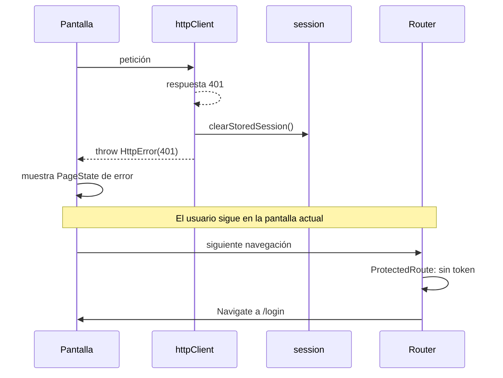

# Routing y navegación

## Configuración

`createBrowserRouter` de react-router-dom 7.18.0, definido íntegramente en `src/app/router.tsx` (49 líneas). **Sin rutas por archivo, sin loaders, sin actions, sin `errorElement`.**

```tsx
export const router = createBrowserRouter([
  { path: '/login', element: withSuspense(<LoginPage />) },
  { path: '/',
    element: <ProtectedRoute><AppShell /></ProtectedRoute>,
    children: [ /* 9 hijos */ ] },
]);
```

Dos rutas de primer nivel. Todo lo autenticado cuelga de la segunda.

## Características de react-router 7 que NO se usan

| Característica | Estado | Consecuencia |
|---|---|---|
| `loader` / `action` | ❌ | Los datos se cargan en `useEffect` dentro de los hooks, después del render |
| `errorElement` | ❌ | Un error de ruta lo captura el `ErrorBoundary` global, no una pantalla por ruta |
| `defer` / `Await` | ❌ | Sin streaming de datos |
| `useSearchParams` | ❌ | **Los filtros y la paginación no viven en la URL** |
| `useNavigation` | ❌ | El estado de carga se lleva a mano con booleanos |
| Modo framework / rutas por archivo | ❌ | Router declarativo en un solo archivo |

La ausencia de `useSearchParams` es la más relevante para el usuario: ver [state-management.md](state-management.md#el-estado-de-url-que-no-existe).

## Guarda de navegación

```tsx
// src/app/ProtectedRoute.tsx
export function ProtectedRoute({ children }: ProtectedRouteProps) {
  const token = getSessionToken();
  if (!token) return <Navigate to="/login" replace />;
  return <>{children}</>;
}
```

13 líneas. Lo que hace y lo que **no** hace:

| Comprobación | Estado |
|---|---|
| ¿Existe un token en `localStorage`? | ✅ Única comprobación |
| ¿El token es válido? | ❌ No se verifica contra el backend |
| ¿Ha caducado? | ❌ No hay fecha de expiración almacenada |
| ¿Tiene el usuario permiso para esta ruta? | ❌ **No hay guardas por rol** |
| ¿Guarda la URL destino para volver? | ❌ Tras el login siempre se va a `/` |

Cualquier cadena no vacía en `cpa.sessionToken` da acceso a todas las pantallas. La protección real es que **ninguna pantalla muestra datos sin que el backend los devuelva**.

### Flujo de expulsión



**Detalle importante:** al recibir un `401` el usuario **no** es redirigido inmediatamente. Se queda en la pantalla, viendo «Tu sesión expiró o no es válida. Vuelve a iniciar sesión.» La redirección ocurre en la **siguiente** navegación.

Es un comportamiento aceptable (evita perder trabajo en curso) pero conviene conocerlo. Ver [operations/runbooks/autenticacion-en-bucle.md](../operations/runbooks/autenticacion-en-bucle.md).

## Navegación programática

| Origen | Destino | Código |
|---|---|---|
| Login correcto | `/` | `navigate('/', { replace: true })` — `useLoginViewModel.ts:24` |
| Cerrar sesión | `/login` | `navigate('/login', { replace: true })` — `AppShell.tsx` |
| Sin token | `/login` | `<Navigate to="/login" replace />` — `ProtectedRoute.tsx:11` |
| Error global | `/` | `window.location.href = '/'` — `ErrorBoundary.tsx:37` |

`ErrorBoundary` usa `window.location` en lugar del router porque, tras un error de render, el árbol de React —y por tanto el router— puede estar en estado inconsistente. Es la elección correcta.

Todas usan `replace: true`, así que el historial del navegador no acumula entradas de redirección.

## Navegación declarativa

`AppShell` construye la barra lateral a partir de los datos:

```tsx
{resourceModules.map((module) => {
  const visibleResources = module.resources.filter(
    (resource) => userHasAnyPermission(resource.permissions));
  if (visibleResources.length === 0) return null;
  …
})}
```

| Elemento | Comportamiento |
|---|---|
| Inicio | `NavLink to="/" end` |
| Tutoriales | `NavLink to={TUTORIAL_CENTER_ROUTE}` |
| Módulos | `<details>` nativo, abierto por defecto para `personas` y `servicios_educativos` |
| Tablero del módulo | `/modulos/{key}` |
| Enlaces de contabilidad | Dos enlaces fijos adicionales solo en ese módulo |
| Recursos | `/modulos/{module}/{resource}` |
| Perfil | `NavLink to="/perfil"` en la cabecera |

Un módulo cuyos recursos estén todos ocultos por permisos **no aparece**.

> **Inconsistencia documentada:** la barra lateral filtra por permisos, pero `ModuleResourcePickerPage` no. Ver [routes/module-board.md](../routes/module-board.md).

## Rutas no enlazadas desde la interfaz

| Ruta | Cómo se llega |
|---|---|
| `/batch/:module/:resource` | **Solo escribiendo la URL.** Ningún enlace de la aplicación apunta aquí |
| `/modulos/contabilidad/transaccion-movimiento-cuenta` | Accesible por URL; oculta de la navegación por `hideFromNavigation` |

Verificado: `grep -rn "/batch/" src` solo devuelve la definición del router.

## Comportamiento móvil

`AppShell` gestiona un cajón lateral:

| Comportamiento | Implementación |
|---|---|
| Cierre al cambiar de ruta | `useEffect` sobre `location.pathname` |
| Bloqueo del scroll de fondo | `document.body.style.overflow = 'hidden'` mientras está abierto, restaurando el valor previo |
| Botón de menú | `aria-expanded`, `aria-controls="app-sidebar"`, `aria-label` dinámico |
| Superposición | `<button>` con `aria-label="Cerrar menú de navegación"` y atributo `hidden` |

Usar un `<button>` real como superposición —en lugar de un `<div>` con `onClick`— es correcto: es enfocable y accionable con teclado.

## Reescritura en el servidor

Al ser una SPA con historial de navegador, **toda** URL profunda debe servir `index.html`:

| Alojamiento | Regla |
|---|---|
| nginx | `try_files $uri $uri/ /index.html` (`docker/nginx.conf`) |
| Cloudflare Workers | Comportamiento por defecto del manejador de assets |
| `vite preview` | Lo hace por defecto |

Sin esta regla, recargar `/perfil` devuelve un 404 del servidor. Ver [operations/runbooks/pantalla-en-blanco.md](../operations/runbooks/pantalla-en-blanco.md).

## Fuente duplicada de rutas

`features/tutorials/domain/tutorialRoutes.ts` mantiene `APP_ROUTE_PATTERNS`, un espejo manual de las rutas del router, para que el validador de tutoriales no tenga que importar el router perezoso.

Hoy las 9 rutas coinciden. El riesgo de drift y su mitigación están en [module-dependencies.md](module-dependencies.md#duplicación-de-la-fuente-de-verdad-rutas).

## Pruebas

**Ninguna.** Sin pruebas de router, de `ProtectedRoute`, de redirecciones ni de navegación. Clasificado HIGH en [reports/documentation-gap-analysis.md](../reports/documentation-gap-analysis.md).
