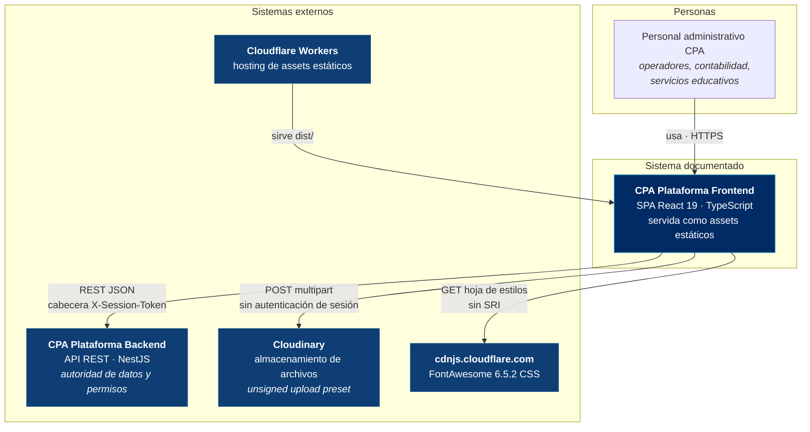
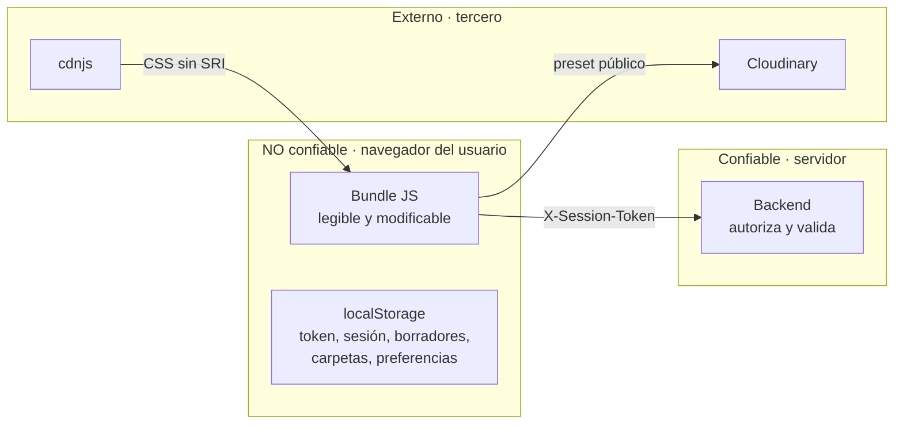

# C4 nivel 1 — Contexto del sistema

Fuente oficial del modelo: [`structurizr/workspace.dsl`](../../structurizr/workspace.dsl). El diagrama Mermaid siguiente es su representación navegable.

## Diagrama

## Actores

| Actor | Descripción | Cómo se identifica |
|---|---|---|
| Personal administrativo CPA | Único tipo de usuario. Opera los 59 recursos según sus permisos | Usuario/correo + contraseña contra el backend |

**No hay usuarios anónimos**: la única ruta pública es `/login`. No hay portal de estudiantes, padres ni tutores en este frontend, aunque esas entidades existan como **datos** en el sistema.

## Sistemas externos

### CPA Plataforma Backend

| Aspecto | Valor |
|---|---|
| Protocolo | REST sobre HTTPS, JSON |
| Base URL | `VITE_API_BASE_URL`, fijada en tiempo de build |
| Autenticación | Cabecera `X-Session-Token` |
| Familias de endpoints | 9 documentadas + 59 recursos CRUD |
| Especificación | ❌ **No hay OpenAPI accesible desde este repositorio** |
| Autoridad | Datos, permisos y reglas de negocio |

El frontend **no valida el token**: cualquier cadena en `localStorage` lo hace pasar por `ProtectedRoute`. Solo el backend decide.

### Cloudinary

| Aspecto | Valor |
|---|---|
| Uso | Subida de comprobantes, imágenes y documentos |
| Ruta | **Navegador → Cloudinary, directo.** No pasa por el backend |
| Autenticación | Ninguna. *Unsigned upload preset* público |
| Endpoints | `api.cloudinary.com/v1_1/{cloud}/image/upload` y `/auto/upload` |

Es la única integración que **atraviesa el límite de confianza sin credencial de sesión**. Ver [security/threat-model.md](../security/threat-model.md#t-06).

### cdnjs.cloudflare.com

| Aspecto | Valor |
|---|---|
| Uso | Hoja de estilos de FontAwesome 6.5.2 |
| Declaración | `index.html:14` |
| Integridad | ❌ **Sin `integrity` (SRI) ni `crossorigin`** |
| Redundancia | Los paquetes npm `@fortawesome/*` ya están instalados |

Un compromiso de ese CDN podría inyectar CSS arbitrario en la aplicación. Al no haber CSP, tampoco hay contención. Ver [security/dependencies.md](../security/dependencies.md).

### Cloudflare Workers

Sirve el contenido de `dist/` versionado en el repositorio. Nombre del Worker: `cpaplataformafrontend` (`wrangler.jsonc`). Dominio de referencia documentado en los comentarios del propio archivo, coincidente con el origen que el backend acepta en `CORS_ORIGINS`.

## Límites de confianza

Consecuencias que el diseño debe asumir, y asume:

1. **Todo lo que llega al bundle es público.** Incluidas las variables `VITE_*` y, hoy, las credenciales de SEC-01.
2. **Los permisos del frontend son cosmética.** `userHasAnyPermission` oculta botones; no impide peticiones. El backend debe rechazar toda operación no autorizada.
3. **`localStorage` es manipulable.** Un usuario puede editar su sesión guardada y ponerse `esSuperUsuario: true`; el frontend le mostrará todos los botones. El backend seguirá rechazando.

Modelado formal con STRIDE en [security/threat-model.md](../security/threat-model.md).

## Lo que NO existe en el contexto

| Elemento | Verificación |
|---|---|
| Proveedor de identidad externo (OAuth, SSO, SAML) | El login es directo contra el backend |
| Pasarela de pagos | Ninguna referencia |
| Servicio de correo o notificaciones push | Ninguna referencia |
| WebSockets / SSE / polling | `grep -rn "WebSocket\|EventSource\|setInterval" src` → sin uso para datos |
| CDN de imágenes propio | Las imágenes son de Cloudinary o `public/logo.png` |
| Servicio de telemetría (Sentry, Datadog, GA) | Ninguno |
