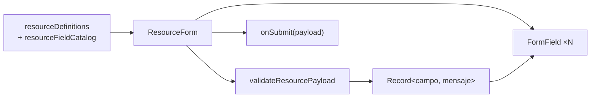

# Formularios y validación

## Modelo

**Implementación propia, sin librerías.** No hay react-hook-form, Formik, Zod ni Yup. Los formularios se generan a partir de las definiciones de recurso y se validan con `shared/validation/formValidation.ts` (341 líneas).



## Definición de un campo

```ts
interface ResourceFieldDefinition {
  name: string;
  label: string;
  type: FieldType;
  required?: boolean;
  readOnly?: boolean;          // el sistema lo calcula; se muestra pero no se envía
  placeholder?: string;
  options?: Array<string | SelectOption>;
  relation?: ResourceLookupRelation;      // origen remoto de opciones
  selectSource?: 'enum' | 'catalog' | 'foreignKey';
  valueKind?: 'string' | 'number' | 'boolean';
  min?, max?, maxLength?: number;
  checks?: string[];                       // validaciones con nombre
  helpText?: string;
  conditionalOptions?: ConditionalSelectOptions;
  requiredWhen?: Record<string, string | number | boolean>;
  visibleWhen?: Record<string, string | number | boolean>;
  exclusiveGroup?: string;
}
```

Es un motor de formularios declarativo bastante completo. Los 59 recursos se describen con estas propiedades y `resourceFieldCatalog.ts` (**4 803 líneas**) las enriquece.

### Campos condicionales

| Propiedad | Efecto | Ejemplo real |
| --- | --- | --- |
| `visibleWhen` | El campo solo se muestra si la condición se cumple | `nivel_actual` solo si `tipo === 'COLEGIAL'` (estudiante) |
| `requiredWhen` | El campo es obligatorio solo si la condición se cumple | `fecha_baja` obligatoria si `estado === 'RETIRADA'` (inscripción) |
| `conditionalOptions` | Las opciones dependen del valor de otro campo | `dependsOn` + `valuesByControllerValue` |
| `exclusiveGroup` | Solo uno de los campos del grupo puede tener valor | Entidades de `cuenta-asignacion` |

La comparación es **textual**: `String(payload[name]) === String(expected)` (`formValidation.ts:85`).

## Reglas de validación

### Genéricas, por campo

Ejecutadas en orden; **el primer fallo corta con `continue`**, así que solo se muestra un error por campo.

| Orden | Regla | Mensaje |
| --- | --- | --- |
| 1 | `required` o `requiredWhen` con valor vacío | `Campo obligatorio.` |
| 2 | Numérico no parseable | `Debe ser un número válido.` |
| 3 | `checks: positiveInteger` | `Debe seleccionar un registro válido.` |
| 4 | `checks: positiveNumber` | `{label} debe ser mayor a cero.` |
| 5 | `checks: nonNegativeDecimal` | `{label} no puede ser negativo.` |
| 6 | `min` | `El valor mínimo permitido es {min}.` |
| 7 | `max` | `El valor máximo permitido es {max}.` |
| 8 | Opción condicional inválida | `Seleccione una opción válida para la selección anterior.` |
| 9 | Opción estática inválida | `Seleccione una opción válida del catálogo.` |
| 10 | `maxLength` | `Máximo {n} caracteres.` |
| 11 | `type: email` o `checks: email` | `Ingrese un correo válido.` |
| 12 | `checks: url` (solo http/https) | `Ingrese un enlace válido con http o https.` |
| 13 | `checks: phoneLoose` | `Ingrese un teléfono válido.` |
| 14 | `checks: accountingCode` | `Ingrese un código contable válido…` |
| 15 | `checks: costCenterCode` | `Ingrese un código de centro de costo válido, por ejemplo CC-ADM.` |

Un valor vacío **no obligatorio** salta todas las validaciones (`if (isBlank(value)) continue`), lo cual es correcto.

> **Nota de diseño documentada en el código:** la validación de `type: 'email'` se añadió porque antes solo se comprobaba con `checks`, dejando el control al validador nativo del navegador, que corta el envío sin pintar nada dentro del modal. Validado en la aplicación, el mensaje aparece junto al campo.

### Pares temporales

Se comprueban siempre que ambos campos existan en el payload (`formValidation.ts:194-207`):

| Inicio | Fin | Mensaje |
| --- | --- | --- |
| `fecha_inicio` | `fecha_fin` | La fecha fin debe ser mayor o igual a la fecha inicio. |
| `fecha_ingreso` | `fecha_salida` | La fecha salida debe ser mayor o igual a la fecha ingreso. |
| `vigente_desde` | `vigente_hasta` | La vigencia hasta debe ser mayor o igual a la vigencia desde. |
| `periodo_inicio` | `periodo_fin` | El periodo fin debe ser mayor o igual al periodo inicio. |
| `hora_inicio_real` | `hora_fin_real` | La hora fin debe ser mayor o igual a la hora inicio. |

### Reglas de negocio por recurso

Siete recursos tienen validación específica:

| Recurso | Regla |
| --- | --- |
| `centro-costo` | La cuenta de costo debe ser distinta de la de ingreso |
| `centro-costo-mapa` | Al menos 1 entidad asociada; más de 3 se considera ambiguo |
| `cuenta-asignacion` | Según `entidad_tipo` (10 tipos), exige el id correspondiente |
| `pago-tutor` | `total = subtotal + ajustes` (tolerancia 0,009); `fecha_pago >= fecha_aprobacion` |
| `grupo-cuenta` | Subtipo válido según tipo (BALANCE → ACTIVO/PASIVO/PATRIMONIO; RESULTADOS → INGRESO/GASTO); subgrupo válido según subtipo; un grupo no puede ser su propio padre; `orden_reporte` entero > 0 |
| `deuda` | `monto_inicial > 0`; `plazo_meses` entero > 0 |
| `pago` | Al menos un componente del pago mayor que cero |

`grupo-cuenta` normaliza cuatro escrituras del tipo «resultados» (`RESULTADOS`, `ESTADO_RESULTADO`, `ESTADO_DE_RESULTADO`, `ESTADO_DE_RESULTADOS`) a una sola.

Es contabilidad real codificada en el frontend. **El backend debe validar lo mismo**: estas reglas son ayuda al usuario, no garantía de integridad.

## Ciclo de vida del formulario

| Fase | Comportamiento |
| --- | --- |
| Apertura | `Modal` con `ResourceForm` o `TransactionForm` según `resource.composite` |
| Carga de opciones remotas | Los campos con `relation` cargan opciones; mientras tanto el control está deshabilitado y muestra «Cargando opciones...» |
| Edición de transacción | Se enriquece el registro con sus movimientos antes de abrir |
| Validación | **Solo al enviar.** No hay validación al perder el foco ni mientras se escribe |
| Envío | `isSaving` deshabilita los controles |
| Éxito | Se cierra el modal, se recarga la lista y se muestra mensaje |
| Error | El mensaje del backend aparece en la pantalla |

**Prevención de envío duplicado:** por `isSaving`, que deshabilita el botón. No hay clave de idempotencia.

## Borradores

Dos vías coexistentes:

| Vía | Módulo | Persistencia |
| --- | --- | --- |
| Local | `shared/services/localDraftStore.ts` | `localStorage`, TTL 7 días |
| Remota | `persistentDraftApi` / `backendDraftApi` | `POST/PATCH /api/administracion/registro-borrador` |

`localDraftStore` es el módulo mejor diseñado en materia de privacidad:

| Protección | Detalle |
| --- | --- |
| Saneado recursivo | Elimina claves que coincidan con `password`, `contrasena`, `contraseña`, `token`, `secret`, `hash`, `session` |
| Caducidad | 7 días; el borrador expirado se borra al leerlo |
| Versionado | Campo `version` |
| Recuperación | JSON corrupto → se borra y devuelve `null` |
| Clave | `cpa.localDraft:<recurso>:create` o `:edit:<id>` |

**Las contraseñas nunca llegan a `localStorage`.**

## Campos `readOnly`

Se muestran deshabilitados para poder consultarlos, pero **nunca viajan en el payload**. Caso real: `codigo_estudiante`, que la base genera con formato `EST-AAAA-NNNNN`.

## Accesibilidad de los formularios

| Aspecto | Estado |
| --- | --- |
| Etiqueta asociada al control | ✅ `<label htmlFor>` en los cuatro modos de `FormField` |
| Mensaje de error vinculado | ❌ **Sin `aria-describedby`**: el error se ve pero no se anuncia al enfocar el campo |
| Estado inválido | ❌ **Sin `aria-invalid`** |
| Obligatorio | ❌ Solo un asterisco visual; sin `aria-required` ni `required` |
| Ayuda contextual | ✅ `InfoHint` con `aria-describedby` |
| Resumen de errores al enviar | ❌ No existe; tampoco se mueve el foco al primer campo con error |
| Validación nativa | `LoginForm` usa `noValidate`; `ResourceForm` no lo declara |

Los cuatro fallos afectan a **todos los formularios de los 59 recursos**. Es el conjunto de hallazgos de accesibilidad de mayor alcance del proyecto. Ver [../accessibility/forms-and-errors.md](../accessibility/forms-and-errors.md).

> **Contraste:** `LoginForm`, que **no** usa `FormField`, sí implementa `aria-invalid`, `aria-describedby` y `role="alert"`. El patrón correcto ya existe en el código; falta trasladarlo a `FormField`.

## Pruebas

| Módulo | Cobertura |
| --- | --- |
| `formValidation.ts` (341 líneas, 15 reglas genéricas + 7 recursos) | ❌ **Ninguna** |
| `transactionFormModel.ts` | ✅ 9 casos |
| `fieldTooltips.ts` | ✅ 5 casos |
| `SearchableSelect` (`matches`, `normalizeForSearch`) | ✅ 7 casos |
| `localDraftStore` (`sanitizeDraftPayload`, TTL) | ❌ Ninguna |
| `ResourceForm` / `FormField` (componentes) | ❌ Ninguna (no hay pruebas de componente) |

`validateResourcePayload` es una **función pura, exportada, con 22 ramas de decisión y reglas contables reales**. Es el mayor hueco de prueba del proyecto por relación riesgo/coste. Ver [../testing/strategy.md](../testing/strategy.md).
