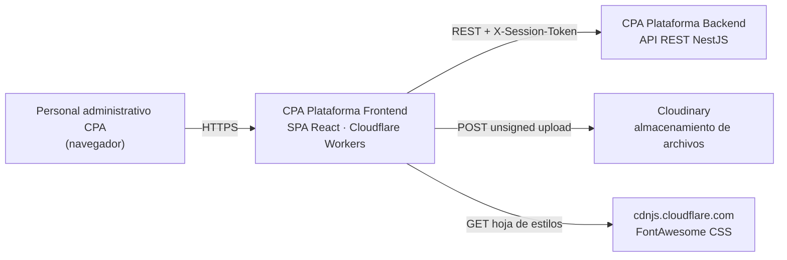

# Portal técnico · CPA Plataforma Frontend

> Documentación del frontend real, verificada contra el código del commit `618e5c3` (2026-08-04).
> Versión del producto: **1.1.37** · Propietario: equipo CPA Plataforma.

---

## Qué es este producto

Panel administrativo interno del **Centro de Preparación Académica (CPA)**. Es una aplicación de una sola página que da a personal administrativo acceso CRUD a **59 recursos de negocio** repartidos en **9 módulos** (personas, servicios educativos, contabilidad, administración, infraestructura, inventario, deuda, societario, seguridad), más cinco pantallas especializadas: parte de clases pasadas, planilla de asistencia, catálogos de cuentas operativas, biblioteca de archivos y centro de tutoriales.

El frontend **no contiene lógica de autorización propia**: la autoridad es el backend. Lo que el frontend hace es ocultar opciones y presentar errores legibles.

## Stack verificado

| Capa | Tecnología |
|---|---|
| UI | React 19.2.7 · CSS Modules · variables CSS |
| Routing | react-router-dom 7.18.0 (`createBrowserRouter`), SPA/CSR pura |
| Build | Vite 8 · TypeScript 6 (`strict`) · Yarn Classic 1.22.22 |
| Datos | `fetch` nativo envuelto en `httpClient` propio. Sin React Query ni store global |
| Pruebas | Jest 30 + ts-jest + jsdom · 156 casos en 12 suites |
| Despliegue | Cloudflare Workers (assets estáticos desde `dist/` versionado) |

Detalle completo y evidencia: [reports/baseline.md](reports/baseline.md).

---

## ⚠️ Estado de preparación productiva

**NO APTO PARA PRODUCCIÓN** — existe 1 requisito bloqueante abierto.

| ID | Bloqueante | Dónde |
|---|---|---|
| SEC-01 | Credenciales de administrador embebidas en el código fuente y compiladas al bundle público servido por Cloudflare | [security/frontend-security.md](security/frontend-security.md) |

Veredicto completo y checklist: [reports/production-readiness.md](reports/production-readiness.md) y [reports/final-validation.md](reports/final-validation.md).

---

## Mapa de navegación

### Empezar
- [Prerrequisitos](getting-started/prerequisites.md) · [Instalación local](getting-started/local-setup.md) · [Variables de entorno](getting-started/environment-variables.md)
- [Comandos](getting-started/commands.md) · [Ejecutar pruebas](getting-started/running-tests.md) · [Resolución de problemas](getting-started/troubleshooting.md)

### Negocio
- [Contexto de negocio](business/business-context.md) · [Actores y roles](business/actors-and-roles.md) · [Capacidades](business/capabilities.md)
- [Journeys de usuario](business/user-journeys.md) · [Reglas de negocio](business/business-rules.md) · [Glosario](business/glossary.md)

### Arquitectura
- [Visión general](architecture/overview.md) · [Contexto del sistema (C4)](architecture/system-context.md) · [Contenedores (C4)](architecture/containers.md)
- [Capas del frontend](architecture/frontend-layers.md) · [Dependencias entre módulos](architecture/module-dependencies.md)
- [Estrategia de renderizado](architecture/rendering-strategy.md) · [Routing y navegación](architecture/routing-and-navigation.md)
- [Gestión de estado](architecture/state-management.md) · [Flujo de datos](architecture/data-flow.md)
- [Límites de error](architecture/error-boundaries.md) · [Mapa de integraciones](architecture/integration-map.md)

### Producto
- [Catálogo de rutas](routes/route-catalog.md) — las 10 rutas registradas, una ficha por ruta
- [Catálogo de componentes](components/catalog.md) · [Sistema de diseño](design-system/tokens.md)

### Datos y estado
- [Estado de servidor](data-and-state/server-state.md) · [Estado de cliente](data-and-state/client-state.md)
- [Formularios y validación](data-and-state/forms-and-validation.md) · [Caché](data-and-state/caching.md) · [Persistencia](data-and-state/persistence.md)

### Integraciones
- [API del backend](integrations/backend-api.md) · [Autenticación](integrations/authentication.md)
- [Almacenamiento de archivos](integrations/file-storage.md) · [Servicios externos](integrations/external-services.md)

### Calidad
- [Accesibilidad](accessibility/standard-and-scope.md) · [Informe de auditoría a11y](accessibility/audit-report.md)
- [Rendimiento y presupuestos](performance/budgets.md) · [Análisis de bundle](performance/bundle-analysis.md)
- [Seguridad](security/frontend-security.md) · [Modelo de amenazas](security/threat-model.md) · [Privacidad](security/privacy.md)
- [Estrategia de pruebas](testing/strategy.md) · [Matriz de trazabilidad](governance/traceability-matrix.md)

### Operación
- [Entornos](operations/environments.md) · [Build](operations/build.md) · [Despliegue](operations/deployment.md) · [Rollback](operations/rollback.md)
- [Runbooks](operations/runbooks/index.md) — 12 procedimientos de incidente
- [Observabilidad](observability/error-reporting.md)

### Gobierno
- [Decisiones de arquitectura (ADR)](adr/index.md) · [Política documental](governance/documentation-policy.md)
- [Política de cero regresiones](governance/zero-regression-policy.md) · [Propietarios](governance/ownership.md)

### Informes
- [Línea base](reports/baseline.md) · [Auditoría Graphify](reports/graphify-audit.md) · [Inventario del frontend](reports/frontend-inventory.md)
- [Análisis de brechas](reports/documentation-gap-analysis.md) · [Validación de regresión](reports/regression-validation.md)
- [Preparación productiva](reports/production-readiness.md) · [Validación final](reports/final-validation.md)

---

## Journeys principales

| Journey | Actor | Ruta de entrada |
|---|---|---|
| Iniciar sesión | Personal administrativo | `/login` |
| Consultar y filtrar un recurso | Operador | `/modulos/:module/:resource` |
| Alta o edición de un registro | Operador con permiso `CREATE` | modal dentro de la ruta anterior |
| Registrar parte de clases pasadas | Contabilidad | `/modulos/contabilidad/venta-clase` |
| Pasar lista de un curso | Servicios educativos | `/modulos/servicios_educativos/asistencia-masiva` |
| Configurar cuentas operativas | Contabilidad | `/contabilidad/catalogos-cuentas-operativas` |
| Subir y organizar archivos | Contabilidad | `/contabilidad/archivos` |
| Importación masiva por archivo | Operador | `/batch/:module/:resource` |
| Seguir un tutorial guiado | Cualquiera | `/tutoriales` |

Detalle paso a paso: [business/user-journeys.md](business/user-journeys.md).

---

## Diagrama de contexto

Versión completa con límites de confianza: [architecture/system-context.md](architecture/system-context.md).

---

## Cómo usar y mantener esta documentación

- **Toda afirmación técnica aquí está trazada** a un archivo y línea del repositorio, a un comando ejecutado o a una prueba. Si no encuentras la traza, es un defecto documental: repórtalo.
- Cuando cambies rutas, props públicas, componentes compartidos, contratos, permisos o variables de entorno, actualiza el documento asociado en el mismo pull request. Ver [governance/change-management.md](governance/change-management.md).
- Validación automática de enlaces y cobertura: `node scripts/check-doc-links.mjs` y `node scripts/check-doc-coverage.mjs`. Ver [governance/documentation-policy.md](governance/documentation-policy.md).

---

## Qué NO cubre esta documentación

Declarado explícitamente para que la ausencia no se lea como omisión:

| Ausencia | Motivo |
|---|---|
| Especificación OpenAPI del backend | No existe en este repositorio; el contrato se documenta tal como lo **consume** el frontend |
| Storybook o catálogo visual | No existe en el proyecto; incorporarlo es una propuesta de cambio, no una acción documental |
| Cobertura de pruebas | Ninguna herramienta la genera hoy |
| Capturas de pantalla | No hay entorno de navegador ni datos sintéticos seguros disponibles durante la auditoría |
| Métricas Core Web Vitals de campo | No hay telemetría de rendimiento instrumentada |
