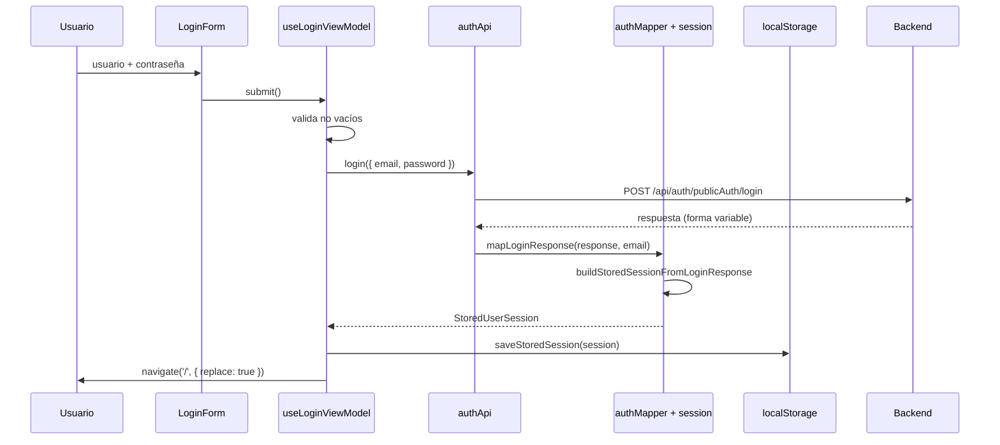

# Autenticación

## Modelo

**Token opaco en `localStorage`, enviado como cabecera propia.** No es OAuth, ni JWT verificado en cliente, ni cookies de sesión.



## Estructura de la sesión

```ts
// shared/auth/session.ts:1-12
export interface StoredUserSession {
  sessionToken: string;
  idSesion?: string;
  email: string;
  nombreUsuario?: string;
  nombreCompleto?: string;
  tipoUsuario?: string;
  esSuperUsuario: boolean;
  roles: string[];
  permisos: string[];
  rawUser?: unknown;      // ⚠️ el objeto de usuario completo del backend
}
```

`rawUser` guarda **la respuesta íntegra del usuario**, sin filtrar. Cualquier campo que el backend incluya —fecha de nacimiento, teléfono, identificadores internos— queda persistido en `localStorage` indefinidamente. Ver [security/privacy.md](../security/privacy.md).

## Persistencia

`saveStoredSession` (`session.ts:92-96`) escribe **cinco claves**:

| Clave | Contenido | Motivo de la duplicación |
|---|---|---|
| `cpa.sessionToken` | token | Convención con punto |
| `cpa_session_token` | token | Convención con guion bajo |
| `cpa.userEmail` | correo | — |
| `cpa_user_email` | correo | — |
| `cpa.session` | objeto completo en JSON | Fuente principal |

La duplicación de nomenclatura sugiere compatibilidad con una versión anterior. No hay comentario que lo explique ni ADR que lo respalde: es **deuda sin documentar** que este documento deja registrada.

`getSessionToken()` (líneas 67-73) lee en orden: `cpa.sessionToken` → `cpa_session_token` → `cpa.session.sessionToken` → `cpa.session.idSesion`.

## Envío del token

```ts
// httpClient.ts:73-76
function appendSessionHeaders(headers: Record<string, string>, token: string | null): void {
  if (!token) return;
  headers['X-Session-Token'] = token;
}
```

- Cabecera **propia**, no `Authorization: Bearer`.
- Si no hay token, la petición sale **sin la cabecera** (no se bloquea).
- Aplica igual a `request` y a `upload`.
- **No se envían cookies**: no hay `credentials: 'include'`.

Implicación para CORS: el backend debe exponer `X-Session-Token` en `Access-Control-Allow-Headers`. Como no se usan credenciales, `Access-Control-Allow-Origin: *` sería técnicamente válido, aunque no recomendable.

## Ciclo de vida de la sesión

| Evento | Comportamiento | Código |
|---|---|---|
| Inicio de sesión | Se escriben las 5 claves | `session.ts:92-96` |
| Cada petición | Se lee el token de `localStorage` | `httpClient.ts:83,117` |
| Respuesta `401` | `clearStoredSession()` | `httpClient.ts:104,133` |
| Cierre de sesión manual | `clearStoredSession()` + `navigate('/login')` | `AppShell.tsx` |
| Navegación protegida sin token | `<Navigate to="/login" replace />` | `ProtectedRoute.tsx:11` |
| Caducidad | ❌ **No existe.** No se guarda fecha de expiración ni se comprueba | — |
| Renovación | ❌ No hay refresh token ni endpoint de renovación | — |
| Cierre de sesión en servidor | ❌ **No se notifica al backend** | — |

> **Consecuencia operativa:** cerrar sesión en el frontend **no invalida la sesión en el servidor**. El token sigue siendo válido hasta que el backend lo caduque por su cuenta. Si el token se filtra, cerrar sesión no lo mitiga.

`clearStoredSession()` (línea 98-100) borra **solo** las 5 claves de sesión. **No borra** borradores, carpetas de la biblioteca ni progreso de tutoriales: esos datos quedan disponibles para el siguiente usuario del mismo navegador.

## Autorización en la interfaz

`userHasAnyPermission(required)` (`session.ts:154-173`) es la única función de autorización del frontend.

### Formato de los permisos

`resourceDefinitions` los declara como cadena: `"create=PERSONAS.PERSONA_ESTUDIANTE.CREATE"`.

`parsePermissionString` (líneas 142-152) separa por `;` y `,`, y en cada trozo por `=` quedándose con la parte derecha. Es decir, de `create=X.Y.CREATE` extrae `X.Y.CREATE`.

`normalizeToken` (líneas 31-33) pasa a mayúsculas y sustituye espacios y guiones por `_`: `Super Admin` → `SUPER_ADMIN`.

### Lógica de decisión

```ts
if (!required) return true;                       // 1
const session = getStoredSession();
if (!session) return false;
if (session.esSuperUsuario) return true;          // 2
if (requiredPermissions.length === 0) return true;// 3
if (session.permisos.length === 0) return true;   // 4 ← modo permisivo
return requiredPermissions.some(p => userPermissions.has(p) || userRoles.has(p));
```

**Cuatro caminos devuelven `true` sin comprobar nada.** El cuarto está comentado en el código:

> «Modo seguro práctico: si el sistema todavía no envía matriz de permisos, el frontend no inventa bloqueos. Cuando sí llegan permisos, se respetan.»

Es una decisión consciente y razonable —evita bloquear a todos si el backend aún no envía permisos— pero significa que **la interfaz no es una barrera de seguridad**. Combinado con que los 5 recursos de `seguridad` declaran `permissions: ""` (camino 1 y 3), la administración de roles y permisos **nunca se oculta en el frontend**.

### Dónde se aplica

| Lugar | Aplica |
|---|---|
| Barra lateral de `AppShell` | ✅ Oculta recursos y módulos completos |
| `ResourceListPage` | ✅ Crear, editar, inhabilitar, exportar |
| `ModuleResourcePickerPage` | ❌ Muestra todos los recursos |
| `ResourceBatchPage` | ❌ Sin comprobación |
| `CatalogosOperativosPage` | ❌ Sin comprobación |
| `FileLibraryPage` | ❌ Sin comprobación |
| `ProtectedRoute` | ❌ Solo comprueba que exista token |

### Derivación textual de permisos

`resolveActionPermission` (`ResourceListPage.tsx:88-93`) transforma el permiso de creación en el de otra acción por sustitución de cadenas:

```
"create=PERSONAS.PERSONA_ESTUDIANTE.CREATE"
  → update: "update=PERSONAS.PERSONA_ESTUDIANTE.UPDATE"
  → delete: "delete=PERSONAS.PERSONA_ESTUDIANTE.DELETE"
```

Presupone que el backend nombra los permisos exactamente con ese patrón. **No está verificado contra el backend**; si la convención difiere, la derivación produce permisos inexistentes que —por el modo permisivo— seguirán mostrando el botón.

## Tolerancia del mapeo de login

`buildStoredSessionFromLoginResponse` acepta el token en 9 posiciones distintas y cada campo del usuario con múltiples alias. Detalle en [routes/login.md](../routes/login.md#contratos-de-datos).

Ventaja: sobrevive a cambios del backend.
Coste: es imposible saber, leyendo el frontend, cuál es la forma **real** de la respuesta.

## Riesgos abiertos

| # | Riesgo | Severidad | Documento |
|---|---|---|---|
| SEC-01 | Credenciales de administrador embebidas en el código y en el bundle publicado | **BLOCKER** | [security/frontend-security.md](../security/frontend-security.md) |
| SEC-02 | Token en `localStorage`: accesible desde cualquier JavaScript de la página; sin protección `HttpOnly` | HIGH | [security/browser-storage.md](../security/browser-storage.md) |
| SEC-03 | Sin caducidad ni renovación de sesión en el cliente | MEDIUM | [security/session-and-tokens.md](../security/session-and-tokens.md) |
| SEC-05 | Cerrar sesión no invalida el token en el servidor | MEDIUM | ídem |
| SEC-06 | `rawUser` persiste el objeto completo del usuario sin filtrar | MEDIUM | [security/privacy.md](../security/privacy.md) |
| SEC-07 | Modo permisivo: sin permisos del backend, todos los botones son visibles | MEDIUM | [security/threat-model.md](../security/threat-model.md#t-04) |

## Pruebas

**Ninguna.** `buildStoredSessionFromLoginResponse`, `userHasAnyPermission`, `parsePermissionString` y `normalizeToken` son funciones puras, exportadas y sin cobertura. Es la recomendación de prueba de mayor relación valor/coste del proyecto. Ver [testing/strategy.md](../testing/strategy.md).
