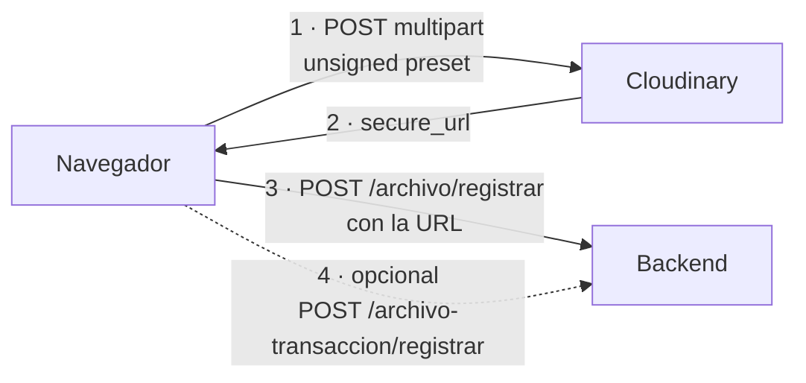

# Almacenamiento de archivos

## Modelo: subida directa del navegador al tercero



**El binario nunca pasa por el backend.** El backend solo guarda la URL resultante.

| Ventaja | Coste |
|---|---|
| El backend no gasta ancho de banda ni almacenamiento | El preset de subida es público |
| Sin límite de tamaño impuesto por el servidor de aplicación | **Sin control de acceso**: cualquiera con el preset puede subir |
| Menos latencia | **Sin atomicidad**: puede quedar un binario huérfano |

## Configuración

| Variable | Uso | Obligatoria |
|---|---|---|
| `VITE_CLOUDINARY_CLOUD_NAME` | Nombre de la cuenta en la URL de subida | Sí, para subir |
| `VITE_CLOUDINARY_UPLOAD_PRESET` | Preset **unsigned** | Sí, para subir |
| `VITE_CLOUDINARY_FOLDER` | Carpeta por defecto | No |
| `VITE_CLOUDINARY_LIBRARY_ROOT_FOLDER` | Carpeta raíz de la biblioteca visual | No |

Todas se resuelven en tiempo de build y quedan **en texto plano en el bundle publicado**.

## API del cliente

`src/shared/services/cloudinaryUpload.ts`

| Función | Endpoint | Validación previa |
|---|---|---|
| `uploadSingleImage(file, {folder})` | `/v1_1/{cloud}/image/upload` | Tipo MIME debe empezar por `image/`; máximo **10 MB** |
| `uploadSingleFile(file, {folder})` | `/v1_1/{cloud}/auto/upload` | Máximo **25 MB**. ⚠️ **Sin validación de tipo** |
| `uploadMultipleImages(files, {folder})` | Varias llamadas a `uploadSingleImage` | Por archivo |

`uploadMultipleImages` usa `Promise.all`: **si una subida falla, rechaza el conjunto**, pero las que ya terminaron quedan subidas. No hay compensación.

### Resultado

```ts
interface CloudinaryUploadResult {
  url: string;          // secure_url
  publicId: string;
  width?, height?, format?, bytes?, resourceType?, originalFilename?
}
```

Si Cloudinary responde OK pero sin `secure_url`, se lanza `Cloudinary no devolvió una URL usable`.

### Manejo de errores

| Situación | Mensaje |
|---|---|
| Falta configuración | `Falta configurar VITE_CLOUDINARY_CLOUD_NAME` / `..._UPLOAD_PRESET` |
| Archivo no es imagen | `El archivo debe ser una imagen válida.` |
| Imagen > 10 MB | `La imagen excede el límite de 10 MB.` |
| Archivo > 25 MB | `El archivo excede el límite de 25 MB.` |
| Fallo de red | `No se pudo subir la imagen/el archivo … por un problema de red.` |
| Rechazo de Cloudinary | `Cloudinary rechazó la subida. {detalle}` |
| Respuesta no JSON | Cae al mensaje genérico |

Mensajes claros y accionables.

## Consumidores

| Componente | Función usada | Contexto |
|---|---|---|
| `FileLibraryPage` | `uploadSingleFile` | Biblioteca visual de archivos |
| `CloudinaryUploadField` | `uploadSingleImage` / `uploadMultipleImages` | Campo de formulario para comprobantes |

## Registro en el backend

Tras la subida, `FileLibraryPage` registra la URL:

| Operación | Ruta |
|---|---|
| Registrar archivo | `POST /api/contabilidad/archivo/registrar` |
| Asociar a transacción | `POST /api/contabilidad/archivo-transaccion/registrar` |
| Listar | `GET /api/contabilidad/archivo?{query}` |

Tipo de asociación por defecto: `SOPORTE`.

> **Anomalía D-03:** existe además el recurso CRUD `archivos-transaccion` en `/api/contabilidad/archivos-transaccion` (plural), distinto de la ruta singular que usa esta pantalla. Ver [backend-api.md](backend-api.md#drift-contractual-detectado).

## Carpetas: solo en el navegador

La estructura de carpetas de la biblioteca se guarda en `localStorage` bajo `cpa.fileLibrary.folders.v1` (`FileLibraryPage.tsx:32,134,146`).

| Consecuencia | Detalle |
|---|---|
| No es compartida | Cada usuario y cada navegador ve su propia organización |
| No sobrevive a la limpieza del navegador | Se pierde con los datos del sitio |
| No se borra al cerrar sesión | `clearStoredSession()` no la toca: **el siguiente usuario del mismo equipo ve las carpetas del anterior** |
| Borrar una carpeta | Solo afecta a `localStorage`. **No borra nada en Cloudinary ni en el backend** |

En Cloudinary, una carpeta existe únicamente cuando contiene al menos un archivo subido a esa ruta.

## Riesgos de seguridad

| # | Riesgo | Severidad | Mitigación |
|---|---|---|---|
| SEC-04 | El preset unsigned es público: **cualquiera puede subir a la cuenta sin sesión en la plataforma** | **HIGH** | Solo en el panel de Cloudinary: restringir formatos, tamaño máximo, carpeta obligatoria y activar moderación. **No es corregible desde el frontend** |
| SEC-08 | `uploadSingleFile` no valida el tipo MIME: se puede subir cualquier extensión | MEDIUM | Restringir formatos permitidos en el preset |
| SEC-09 | Las URLs de Cloudinary son públicas y adivinables si se conoce el `publicId` | MEDIUM | Usar entrega firmada o de acceso restringido para documentos sensibles |
| SEC-10 | Subida no atómica: binario huérfano si falla el registro en backend | LOW | Proceso de conciliación periódico, o mover la subida al backend |

Modelado en [security/threat-model.md](../security/threat-model.md#t-06).

## Lo que no existe

| Elemento | Estado |
|---|---|
| Barra de progreso de subida | ❌ Solo un booleano `isUploading` |
| Cancelación de subida | ❌ Sin `AbortController` |
| Reintento automático | ❌ |
| Antivirus o análisis de contenido | ❌ En el frontend; podría existir en Cloudinary |
| Compresión o redimensionado en cliente | ❌ El archivo sube tal cual |
| Descarga controlada | ❌ Se copia la URL pública |

## Pruebas

Ninguna, ni de `cloudinaryUpload` ni de `fileServerApi`. `validateImageFile`, `validateGenericFile` y `resolveFolder` son funciones puras trivialmente comprobables.
