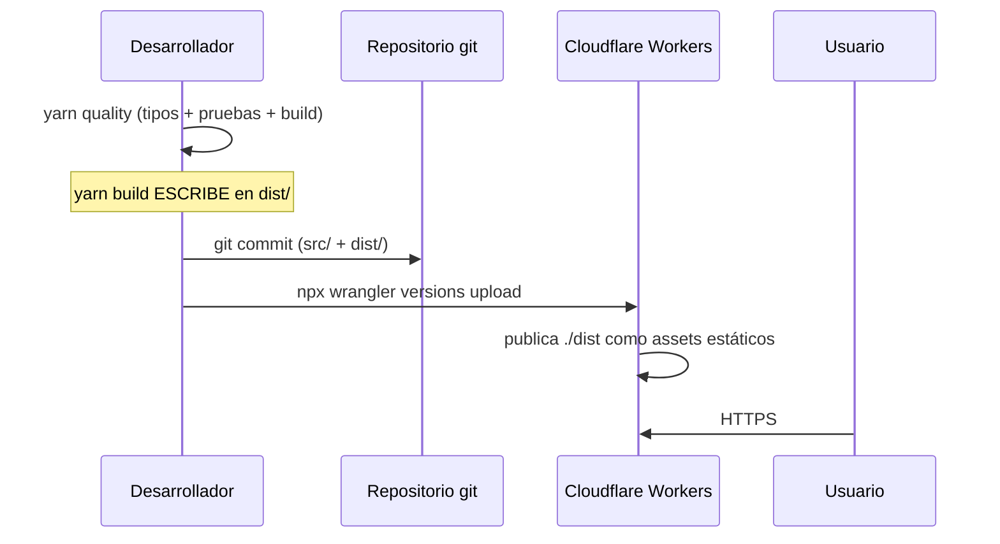

# Despliegue

## Modelo actual: manual, con artefacto versionado



**No hay CI/CD.** Verificado: no existe `.github/workflows/`, `.gitlab-ci.yml`, `Jenkinsfile` ni equivalente. El script `ci:frontend` existe en `package.json` pero **nadie lo invoca automáticamente**.

## La decisión distintiva: `dist/` versionado

`.gitignore` lo declara de forma explícita:

```
# Artefactos de build locales
# OJO: dist/ NO se ignora a proposito. Cloudflare sirve el contenido
# versionado de dist/ tal cual, asi que el build publicado va al repo.
```

30 archivos de `dist/` están bajo control de versiones.

| Consecuencia | Signo |
| --- | --- |
| **Reversión trivial**: `git checkout <commit> -- dist/` recupera el artefacto exacto | ➕ Es la mayor ventaja operativa del proyecto |
| Trazabilidad total entre código y artefacto publicado | ➕ |
| No hace falta infraestructura de CI para publicar | ➕ |
| Cada build ensucia el árbol con archivos de hash nuevo | ➖ |
| Conflictos de merge frecuentes en `dist/` | ➖ |
| **Lo compilado queda en el historial para siempre** | 🔴 Es lo que agrava [SEC-01](../security/frontend-security.md#sec-01): las credenciales están en `dist/` histórico |
| El repositorio crece con cada publicación | ➖ |

Registrada como [ADR-0009](../adr/ADR-0009-dist-versionado.md).

## Cloudflare Workers

```jsonc
// wrangler.jsonc
{
  "name": "cpaplataformafrontend",
  "compatibility_date": "2026-08-04",
  "assets": { "directory": "./dist" }
}
```

- **No hay código de Worker**: es un sitio estático, por eso se declara `assets.directory` y no `main`.
- El archivo existe porque sin él `wrangler` abortaba con `Missing entry-point to Worker script or to assets directory` — documentado en sus propios comentarios.
- `name` debe coincidir **exactamente** con el Worker existente; si no, se publicaría en otro distinto.
- El dominio del Worker debe estar en `CORS_ORIGINS` del backend.

### Publicación

```bash
npx wrangler versions upload
```

### Lo que Cloudflare NO hace aquí

| Aspecto | Estado |
| --- | --- |
| Cabeceras de seguridad (CSP, `X-Frame-Options`, HSTS) | ❌ Ninguna configurada. Ver [../security/content-security-policy.md](../security/content-security-policy.md) |
| Política de caché explícita | ❌ Se usa la predeterminada del manejador de assets |
| Comprobación de salud tras publicar | ❌ Manual |
| Reversión automática | ❌ Manual, desde el panel o desde git |

## Alternativa: Docker + nginx

`Dockerfile` multietapa:

| Etapa | Base | Acción |
| --- | --- | --- |
| build | `node:24-alpine` | `yarn install --frozen-lockfile` y `yarn build` |
| runtime | `nginx:1.27-alpine` | Copia `docker/nginx.conf` y `dist/` |

Incluye `HEALTHCHECK` (`wget` a `/` cada 30 s) y expone el puerto 80.

**Las variables `VITE_*` se pasan como `ARG` de build**, no como variables de entorno del contenedor: se resuelven en tiempo de compilación.

`docker/nginx.conf` tiene una **política de caché mejor definida** que el despliegue en Cloudflare:

| Regla | Efecto |
| --- | --- |
| `/assets/` → `expires 1y; Cache-Control: public, immutable` | Seguro: los nombres llevan hash |
| `= /index.html` → `no-cache, no-store, must-revalidate` | El despliegue nuevo se ve de inmediato |
| `/` → `try_files $uri $uri/ /index.html` | Reescritura de SPA |
| `gzip on`, mínimo 1 024 B | Compresión de texto |

Esta configuración **no está en uso** en producción, pero documenta la intención correcta de caché.

## Configuración por entorno

| Entorno | Origen de variables | Cómo se aplica |
| --- | --- | --- |
| Desarrollo | `.env` (ignorado por git) | Leído por Vite al arrancar |
| Producción | `.env.production` (versionado) | Leído por `vite build` |
| Docker | `ARG` → `ENV` | Durante `yarn build` |
| Cloudflare | **Ninguno en runtime** | Las variables ya están fijadas en el `dist/` publicado |

> **Regla operativa que hay que interiorizar:** cambiar una variable en el panel de Cloudflare **no tiene efecto**. Hay que recompilar y republicar. Ver [configuration.md](configuration.md) y [../operations/runbooks/index.md](runbooks/index.md#r-08).

## Comprobaciones tras publicar (smoke manual)

No existe automatización. Lista mínima:

- [ ] `curl -sI https://<dominio>` devuelve 200
- [ ] `curl -s https://<dominio> | grep -o 'assets/index-[^"]*'` coincide con lo publicado
- [ ] La aplicación carga y muestra el inicio
- [ ] Se puede iniciar sesión
- [ ] Un listado muestra datos (verifica el backend y CORS)
- [ ] Una pantalla con formulario abre y valida
- [ ] Los iconos se ven (verifica el CDN)
- [ ] No hay errores en la consola del navegador

## Riesgos del proceso actual

| # | Riesgo | Severidad | Mitigación propuesta |
| --- | --- | --- | --- |
| 1 | **Nada impide publicar código que no pasa `yarn quality`** | Alto | Pipeline de CI |
| 2 | El `dist/` publicado puede no corresponder al `src/` commiteado si alguien olvida reconstruir | Alto | Verificación de build reproducible en CI |
| 3 | Sin smoke automatizado tras publicar | Medio | Script de comprobación |
| 4 | Sin registro de quién publicó y cuándo | Medio | CI con trazabilidad |
| 5 | El artefacto histórico conserva lo que se compiló, incluidos secretos | **Alto** | No compilar secretos nunca; ver SEC-01 |

## Pipeline propuesto (no implementado)

> Requiere autorización: añade infraestructura y puede bloquear el trabajo del equipo si se configura como puerta obligatoria sin acordar la estrategia de adopción.

```
1. yarn install --frozen-lockfile     # verifica que el lockfile no cambia
2. yarn typecheck
3. yarn test
4. vite build --outDir <temporal>     # NO sobre dist/
5. node scripts/check-bundle-budget.mjs
6. node scripts/check-doc-links.mjs
7. node scripts/check-doc-coverage.mjs
8. node scripts/check-api-contract-drift.mjs
9. Verificar que dist/ commiteado coincide con el build reproducible
10. Publicar y ejecutar smoke
```

**Regla de adopción:** el pipeline **no debe fallar por deuda preexistente** (ausencia de linter, cobertura baja, hallazgos de accesibilidad ya registrados). Debe impedir **regresiones nuevas**. Ver [../governance/change-management.md](../governance/change-management.md).
