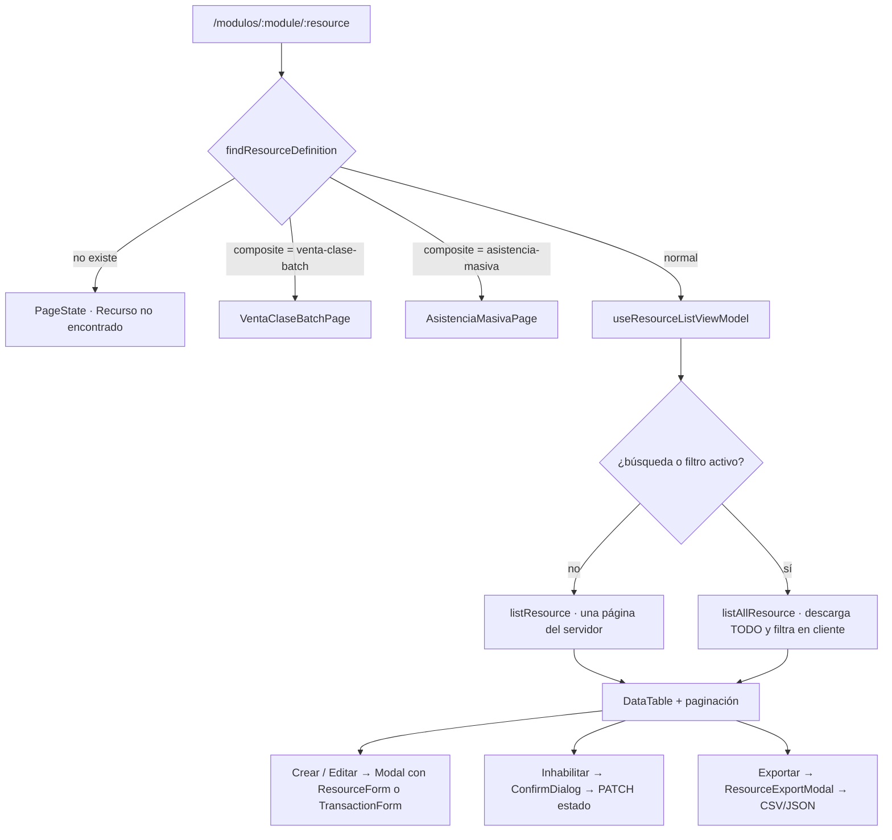

# Ruta `/modulos/:module/:resource`

| | |
|---|---|
| **Patrón** | `/modulos/:module/:resource` |
| **Componente** | `ResourceListPage` → `ResourceListContent` |
| **Archivos** | `src/features/resources/pages/ResourceListPage.tsx` (283 líneas), `src/features/resources/hooks/useResourceListViewModel.ts` (774 líneas) |
| **Layout** | `AppShell` |
| **Parámetros** | `module`, `resource` |

**Es la ruta más importante del producto:** una sola ruta que genera **59 pantallas** distintas y concentra el CRUD completo del sistema.

## Propósito de negocio

Pantalla universal de trabajo: listar, buscar, filtrar, paginar, crear, editar, inhabilitar y exportar registros de cualquiera de los 59 recursos, con la configuración que declara `resourceDefinitions.ts`.

## Acceso y permisos

Protegida por `ProtectedRoute`. Además calcula cuatro permisos derivados (`ResourceListPage.tsx:119-122`):

| Acción | Permiso evaluado | Efecto si falta |
|---|---|---|
| Crear | `resource.permissions` tal cual (`create=MODULO.TABLA.CREATE`) | No aparece el botón «Crear» |
| Editar | El mismo con `create=`→`update=` y `.CREATE`→`.UPDATE` | No aparece el icono de lápiz |
| Inhabilitar | Ídem con `delete=` / `.DELETE` | No aparece el icono de papelera |
| Exportar | `resource.permissions` | No aparece el botón de exportar |

La derivación es **textual** (`resolveActionPermission`, líneas 88-93): sustituye cadenas sobre el permiso de creación. Presupone que el backend nombra los permisos con ese patrón exacto.

> ⚠️ **Modo permisivo por diseño.** `userHasAnyPermission` (`shared/auth/session.ts:154-173`) devuelve `true` cuando:
> - el usuario es superusuario, **o**
> - el permiso requerido está vacío, **o**
> - `session.permisos` está vacío (comentario explícito: *«si el sistema todavía no envía matriz de permisos, el frontend no inventa bloqueos»*).
>
> Si el backend no devuelve permisos en el login, **todos los botones se muestran a todo el mundo**. La autorización real recae íntegramente en el backend. Ver [security/threat-model.md](../security/threat-model.md#t-04).

## Flujo de usuario



### Alta y edición

- Se abren en un `Modal`. Al editar, si el recurso es `transaccion`, primero se enriquece el registro con sus movimientos de cuenta (`enrichTransactionRecordForEdit`, líneas 104-135) haciendo una consulta adicional a `transaccion-movimiento-cuenta`.
- El formulario es `ResourceForm`, salvo para `composite: 'transaction-with-account-movements'`, que usa `TransactionForm`.

### Inhabilitar (borrado lógico)

No existe borrado físico. `buildDisablePayload` (líneas 170-184) detecta la columna de estado y respeta su tipo:

| Tipo de columna | Payload enviado |
|---|---|
| Booleana, o campo `es_activo` / `activo` | `{ [columna]: false }` |
| Texto | `{ [columna]: 'Inactivo' }` |

Si el registro no tiene ninguna columna de estado, `canDisable` devuelve `false` y el botón no se ofrece.

## Estados de interfaz

| Estado | Representación | Línea |
|---|---|---|
| Recurso inexistente | `PageState` «Recurso no encontrado» | 100 |
| Carga inicial | `PageState` «Cargando registros» | 129 |
| Recarga con datos ya en pantalla | Texto «Actualizando resultados...» | 163 |
| Mensaje informativo | Párrafo `styles.message` | 164 |
| Error | `PageState` + acción «Reintentar» | 165 |
| Vacío | `PageState` «Sin registros» + acción «Crear registro» si hay permiso | 167-169 |
| Contenido | `DataTable` + paginación | 171-201 |
| Guardando | `isSaving` deshabilita el diálogo de confirmación | 227 |
| Resultado de inhabilitación | `Modal` compacto con icono de éxito o advertencia | 237-254 |
| Cargando registro a editar | `PageState` «Cargando registro» dentro del modal | 261-262 |
| Búsqueda pendiente (debounce) | `isSearchPending` en `SearchFilterBar` | 160 |

Once estados distintos. Es la pantalla con el catálogo de estados más completo del producto.

## Contratos de datos

| Operación | Método y ruta | Servicio |
|---|---|---|
| Listar | `GET {resource.endpoints.list}?page&limit&offset&orderBy&orderDir&q&search&term&onlyActivos&only_activos&includeInactive&include_inactive&<filtros>&filter_<filtros>` | `listResource` |
| Listar todo | Igual, paginando de 200 en 200 hasta 50 000 | `listAllResource` |
| Detalle | `GET {resource.endpoints.detail(id)}` | `getResource` |
| Crear | `POST {resource.endpoints.create}` | `createResource` |
| Actualizar | `PATCH {resource.endpoints.update(id)}` | `updateResource` |
| Opciones de campos con relación | `GET {field.relation.endpoint}` paginado | `listAllLookupOptions` |

**Duplicación deliberada de parámetros.** `appendQuery` (`resourceApi.ts:41-74`) envía el mismo valor con varios nombres (`q`, `search`, `term`; `onlyActivos` y `only_activos`; `<clave>` y `filter_<clave>`) para tolerar variaciones del backend. Es una estrategia de compatibilidad, no un error; queda registrada porque infla cada URL y hace difícil saber qué parámetro respeta realmente el servidor. Ver [integrations/backend-api.md](../integrations/backend-api.md#tolerancia-de-parámetros).

**Normalización de respuesta.** `normalizeListResult` (`resourceMapper.ts:55-74`) acepta la lista en `rows`, `items`, `results`, `records`, `data`, o anidada bajo `data.*` incluyendo `data.detalle`; y la paginación en `meta`, `pagination` o `paging`.

## Componentes

| Componente | Origen | Papel |
|---|---|---|
| `ResourceHeader` | resources | Título, contadores, ayuda, lanzador de tutorial |
| `SearchFilterBar` | shared | Buscador, filtros, crear, recargar, exportar |
| `DataTable` | shared | Tabla con badges de estado y acciones por fila |
| `Modal` | shared | Contenedor de formulario y de resultado |
| `ConfirmDialog` | shared | Confirmación de inhabilitación |
| `PageState` | shared | Todos los estados no-contenido |
| `ResourceForm` | resources | Formulario CRUD genérico |
| `TransactionForm` | resources | Formulario compuesto de transacción |
| `ResourceExportModal` | resources | Exportación con filtros |
| `HelpGuideModal` | resources | Guía operativa por tabla |

## Comportamientos específicos por recurso

| Recurso | Comportamiento |
|---|---|
| `clase-por-hora`, `clase-curso`, `aula` | Orden visual por hora y coloreado de filas en 8 tonos (`getHourTone`, líneas 55-62). Se muestra una leyenda |
| `transaccion` | Formulario compuesto + enriquecimiento con movimientos al editar |
| `venta-clase` | Sustituida por `VentaClaseBatchPage` |
| `asistencia-masiva` | Sustituida por `AsistenciaMasivaPage` |
| Recursos con `primaryKeys` (seguridad) | El id se compone uniendo las claves con `/` y codificando cada parte |

## Selección y orden de columnas

`useResourceListViewModel` limita la tabla a **14 columnas** (`MAX_TABLE_COLUMNS`) y las ordena por prioridad (`COLUMN_PRIORITY`, líneas 22-40): primero cómo se llama el registro (`nombre_completo`, `nombres`, `apellidos`, `nombre`…), después código y estado, y al final lo operativo. Las columnas de auditoría (`fecha_registro`, `created_at`, `id_usuario_*`…) van al final y solo si sobra espacio.

El comentario del código explica el porqué: sin este orden, los recursos hijos de persona mostraban solo identificadores y las filas eran irreconocibles.

## Analítica

Ninguna. Solo eventos internos del motor de tutoriales.

## Accesibilidad

| Aspecto | Estado |
|---|---|
| Tabla | ⚠️ `<table>` sin `<caption>` ni `scope` en los `<th>` (`DataTable.tsx:86`) |
| Acciones de fila | ✅ `aria-label="Editar registro"` / `"Inhabilitar registro"` |
| Badges de estado | ⚠️ Estado codificado por color y texto; el texto está presente, correcto |
| Cambio de resultados | ❌ Sin región activa. Al aplicar un filtro nada anuncia el nuevo número de registros |
| Paginación | ⚠️ Botones «Anterior»/«Siguiente» con `disabled` correcto, pero sin `aria-label` que indique la página destino |
| Modal | ✅ `role="dialog"`, `aria-modal`, `aria-labelledby`; cierra con `Escape` |
| Modal | ❌ **Sin trampa de foco ni restauración de foco** al cerrar (`Modal.tsx`, `useModalLayer.ts`) |
| Coloreado por hora | ❌ La información de bloque horario se transmite **solo por color** (`data-hour-tone`). Incumple WCAG 1.4.1 |

Ver [accessibility/audit-report.md](../accessibility/audit-report.md).

## Pruebas

| Elemento | Cobertura |
|---|---|
| `ResourceListPage` | ❌ ninguna |
| `useResourceListViewModel` (774 líneas, 22 estados) | ❌ ninguna |
| `resourceMapper` (`normalizeListResult`) | ✅ 3 casos |
| `resourceApi` (`appendQuery`, batch) | ❌ ninguna |
| `formValidation` | ❌ ninguna |

Es el componente de mayor riesgo del producto y el de menor cobertura relativa. Clasificado **CRITICAL** en [reports/documentation-gap-analysis.md](../reports/documentation-gap-analysis.md).

## Notas operativas

### Rendimiento: la descarga completa al filtrar

Cuando hay búsqueda o cualquier filtro activo, el view model **abandona la paginación del servidor** y descarga el recurso entero (`useResourceListViewModel.ts:464-479`):

```
listAllResource(...)  → páginas de 200 registros, hasta 50 000
applyLocalQuery(...)  → filtra, ordena y pagina en el navegador
```

- Sobre una tabla de 20 000 filas son **100 peticiones secuenciales** antes de pintar nada.
- El motivo está comentado en el código: algunos endpoints genéricos no aplican todos los filtros FK en servidor, y la tabla «nunca debe mentir».
- Los debounces amortiguan (900 ms para el buscador, 800 ms para los filtros) pero no eliminan el coste.

Además, los campos con `relation` cargan sus opciones con `listAllLookupOptions(relation, 300, 100000)` — hasta **100 000 opciones** por campo, en paralelo, al montar la pantalla.

Cuantificado en [performance/rendering.md](../performance/rendering.md).

### Riesgo: orden de hooks {#riesgo-orden-de-hooks}

`ResourceListContent` invoca `useResourceListViewModel` **después** de dos `return` condicionales (líneas 107-115). Si el mismo montaje del componente pasara de un recurso compuesto a uno normal, React lanzaría *«Rendered more hooks than during the previous render»*.

Hoy **no ocurre** porque `AppShell.tsx:167` renderiza el contenido con `<div key={location.pathname}>`, lo que fuerza un desmontaje/remontaje en cada navegación.

Es una **dependencia no declarada entre dos archivos distintos**: quitar ese `key` para optimizar el renderizado rompería esta pantalla. Registrado como HIGH en [reports/documentation-gap-analysis.md](../reports/documentation-gap-analysis.md) y anotado en [architecture/routing-and-navigation.md](../architecture/routing-and-navigation.md).

### Filtros ocultos por seguridad

`shouldShowFilter` (líneas 196-203) excluye cualquier campo cuyo nombre contenga `contrasena`, `password`, `hash` o `token`. Impide filtrar —y por tanto sondear— por esos valores.
