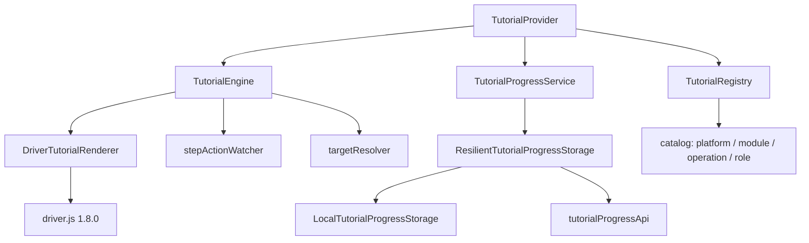

# Ruta `/tutoriales`

| | |
|---|---|
| **Patrón** | `/tutoriales` (constante `TUTORIAL_CENTER_ROUTE`) |
| **Componente** | `TutorialCenterPage` |
| **Archivo** | `src/features/tutorials/pages/TutorialCenterPage.tsx` (275 líneas) |
| **Layout** | `AppShell` (dentro de `TutorialProvider`) |

## Propósito de negocio

Centro de aprendizaje: catálogo de recorridos guiados sobre la propia interfaz, con seguimiento de progreso por usuario. Reduce la curva de entrada de personal nuevo sobre 59 pantallas de trabajo.

Es, con diferencia, el subsistema más desarrollado del frontend: **17 de las 32 comunidades del grafo de código** y **118 de las 156 pruebas** pertenecen a tutoriales.

## Acceso y permisos

- Protegida por `ProtectedRoute`.
- El catálogo se filtra por rol mediante `tutorialAccess.ts`, que lee la sesión de `shared/auth/session`. Un tutorial puede declararse para roles concretos.
- Enlace fijo en la barra lateral (`AppShell.tsx:73-80`).

## Arquitectura de la feature

| Pieza | Archivo | Responsabilidad |
|---|---|---|
| `TutorialProvider` | `react/TutorialProvider.tsx` | Monta el contexto sobre toda el área autenticada |
| `TutorialEngine` | `engine/TutorialEngine.ts` | Máquina de estados del recorrido (nodo más conectado del grafo: 38 aristas) |
| `DriverTutorialRenderer` | `engine/DriverTutorialRenderer.ts` | Adaptador a `driver.js` |
| `targetResolver` | `engine/targetResolver.ts` | Resuelve el elemento DOM de cada paso |
| `stepActionWatcher` | `engine/stepActionWatcher.ts` | Detecta que el usuario hizo la acción pedida |
| `TutorialRegistry` | `registry/TutorialRegistry.ts` | Registro y búsqueda de tutoriales |
| `ResilientTutorialProgressStorage` | `services/` | Combina almacén local y remoto |
| `tutorialAnchors` | `domain/tutorialAnchors.ts` | Contrato de anclajes `data-*` |

### Anclajes: por qué `shared/` depende de `features/tutorials`

Los pasos apuntan a elementos concretos mediante atributos `data-*` generados por `tutorialAnchor()`. Como esos elementos viven en componentes compartidos, `DataTable`, `Modal` y `AppShell` **importan desde `features/tutorials`**, invirtiendo la dirección esperada de dependencia.

Es la única violación sistemática de capas del proyecto, con 15 importaciones. Analizada en [architecture/module-dependencies.md](../architecture/module-dependencies.md#violación-shared--features).

## Flujo de usuario

1. Se abre `/tutoriales` desde la barra lateral.
2. `useTutorials()` entrega catálogo y progreso.
3. Se filtra por texto, categoría, módulo y estado (`todos`, `obligatorios`, `recomendados`, o un estado de progreso).
4. Se elige una tarjeta y se pulsa iniciar, reanudar, reiniciar u omitir.
5. El motor toma el control: `driver.js` resalta el elemento del paso y muestra el globo.
6. Al avanzar se persiste el progreso; al terminar, el tutorial queda completado.

También se puede lanzar un tutorial contextual desde `TutorialLauncher`, presente en la cabecera de `AppShell`, en `ResourceHeader` y en el tablero de módulo.

## Estados de interfaz

| Estado | Representación | Línea |
|---|---|---|
| Cargando | `PageState` «Cargando tutoriales» | 92 |
| Error | `PageState` | 97 |
| Sin coincidencias | `PageState` | 222 |
| Contenido | Rejilla de `TutorialCard` | 235 |
| En progreso | Sección de tutoriales `en_progreso` | 76 |
| Progreso por tutorial | `role="progressbar"` con `aria-valuenow`/`min`/`max` | — |

## Contratos de datos

**`/api/onboarding/tutoriales/progreso`** (`services/tutorialProgressApi.ts:37-40`)

| Método | Ruta | Uso |
|---|---|---|
| `GET` | `/api/onboarding/tutoriales/progreso` | Progreso completo |
| `PUT` | `/api/onboarding/tutoriales/progreso/{tutorialId}` | Actualizar un tutorial |
| `DELETE` | `/api/onboarding/tutoriales/progreso/{tutorialId}` | Reiniciar uno |
| `DELETE` | `/api/onboarding/tutoriales/progreso` | Reiniciar todos |

`tutorialId` se codifica con `encodeURIComponent`.

**Degradación:** `ResilientTutorialProgressStorage` combina el almacén remoto con `LocalTutorialProgressStorage` (`localStorage`). Si la API falla, el progreso sigue funcionando en local y se emite el evento `progress-sync-failed`, que se registra siempre con `console.warn` — también en producción, por decisión explícita comentada en `tutorialAnalytics.ts:47-48`.

Es el **único punto del frontend con una estrategia real de resiliencia** ante fallo del backend.

## Componentes

| Componente | Origen |
|---|---|
| `TutorialCard` | feature `tutorials` |
| `TutorialLauncher` | feature `tutorials` |
| `PageState` | `shared` |

## Analítica

**Único subsistema con telemetría.** `createTutorialAnalytics` (`services/tutorialAnalytics.ts`) define 9 tipos de evento:

`tutorial-started` · `tutorial-completed` · `tutorial-closed` · `tutorial-skipped` · `tutorial-restarted` · `step-skipped` · `action-completed` · `target-missing` · `progress-sync-failed`

| Aspecto | Comportamiento |
|---|---|
| Destino | **Ninguno remoto.** Solo memoria (últimos 50 eventos) y consola |
| En producción | `target-missing` y `progress-sync-failed` se registran siempre con `console.warn`; el resto solo con `debug: true` |
| Datos personales | Ninguno: solo `tutorialId`, `version`, `stepIndex`, `stepId`, `detail` |
| Consentimiento | No aplica: no sale del navegador |

Catálogo completo: [observability/analytics-events.md](../observability/analytics-events.md).

## Accesibilidad

| Aspecto | Estado |
|---|---|
| Barra de progreso | ✅ `role="progressbar"` con `aria-valuenow`, `aria-valuemin`, `aria-valuemax` |
| Filtros | ✅ `aria-pressed` en los botones de filtro |
| Tarjetas | ✅ Estado textual además del icono |
| Recorrido guiado | ⚠️ **La accesibilidad del recorrido la determina `driver.js`**, no este código: foco, `aria-live` y navegación por teclado dependen de la librería. No auditado |
| Movimiento reducido | ❌ No se detecta `prefers-reduced-motion` en ninguna parte del proyecto |

## Pruebas

**El área mejor probada, con diferencia.**

| Suite | Casos |
|---|---:|
| `tutorialEngine.test.ts` | 28 |
| `tutorialProgress.test.ts` | 18 |
| `tutorialRegistry.test.ts` | 16 |
| `tutorialCatalog.test.ts` | 13 |
| `targetResolver.test.ts` | 12 |
| `tutorialValidation.test.ts` | 12 |
| `tutorialRenderer.test.ts` | 10 |
| `tutorialFlow.integration.test.ts` | 9 |
| **Total** | **118** |

`tutorialCatalog.test.ts` valida además que **los anclajes referenciados por los tutoriales existan en el catálogo de anclajes** — una prueba de contrato interno entre la definición del tutorial y el DOM esperado.

## Notas operativas

- `TutorialProvider` envuelve `AppShell`, no `App`: los tutoriales **no existen en `/login`**.
- Preferencia de autoarranque: `tutorialPreferences.ts` guarda la clave `AUTOSTART_KEY` en `localStorage`; si el usuario la desactiva, no se lanzan solos.
- `target-missing` en consola indica que un tutorial apunta a un elemento que ya no existe: es un defecto de sincronización entre el catálogo y la interfaz, y por eso se registra siempre.
- Al validar el catálogo, los problemas se reportan con `console.error` (severidad `error`) o `console.warn` (`catalog/index.ts:43`).

## Observación de gobierno

76 % del esfuerzo de pruebas está en tutoriales, mientras que el CRUD de 59 recursos —el valor de negocio real— tiene 12 casos de prueba. La inversión de calidad no sigue a la inversión de riesgo. Ver [testing/strategy.md](../testing/strategy.md).
