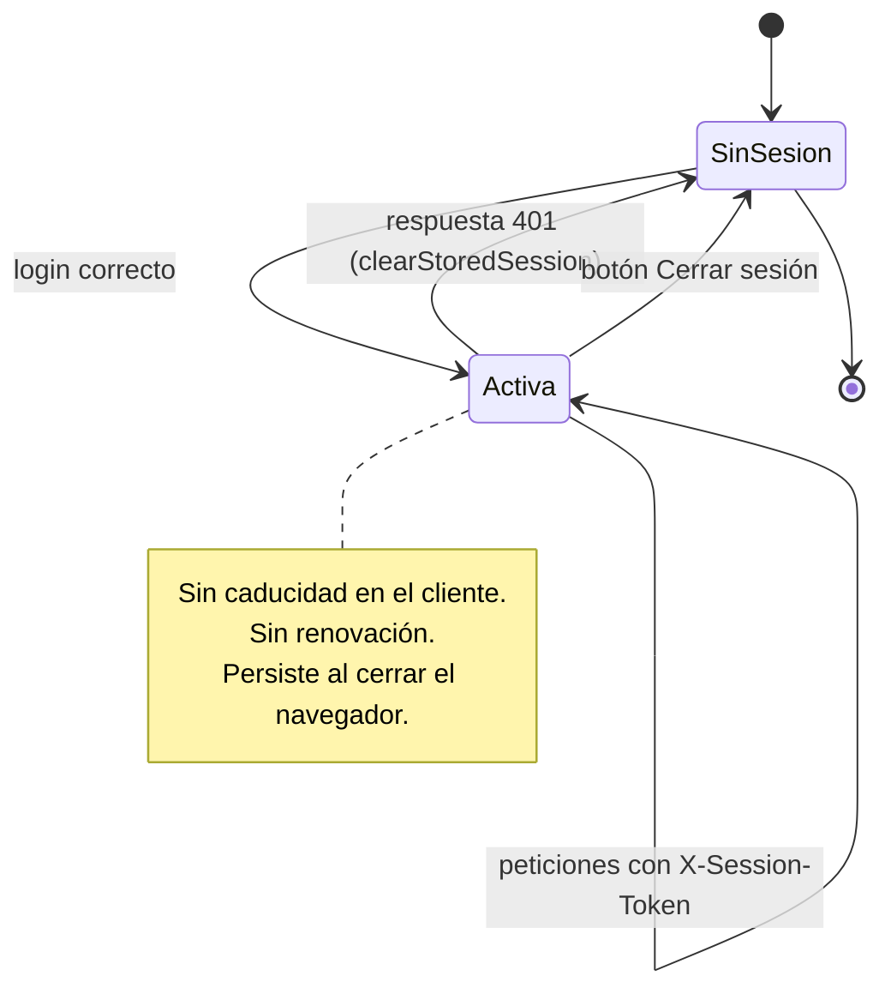

# Sesión y tokens

Complementa [../integrations/authentication.md](../integrations/authentication.md), que describe el flujo. Este documento se centra en el ciclo de vida y sus riesgos.

## Naturaleza del token

| Aspecto | Valor |
| --- | --- |
| Tipo | **Opaco** para el frontend. No se decodifica ni se inspecciona |
| ¿Es un JWT? | Desconocido y **deliberadamente irrelevante**: el frontend nunca lo parsea |
| Transporte | Cabecera `X-Session-Token` |
| Origen | `data.sessionToken` / `data.token` / … / `data.idSesion`, en 9 posiciones aceptadas |
| Almacenamiento | `localStorage`, 5 claves |

Que el token sea opaco es **correcto**: el frontend no debe tomar decisiones de seguridad a partir de su contenido.

## Ciclo de vida



## Lo que falta

| Elemento | Estado | Consecuencia |
| --- | --- | --- |
| Fecha de expiración almacenada | ❌ | El cliente no sabe cuándo caduca; lo descubre con un `401` |
| Refresh token | ❌ | No hay renovación silenciosa |
| Cierre de sesión en servidor | ❌ | **No existe endpoint de logout en el código.** El token sigue vivo tras «Cerrar sesión» |
| Cierre por inactividad | ❌ | Sin temporizador |
| Sesión ligada a la pestaña | ❌ | Se usa `localStorage`, no `sessionStorage` |
| Detección de sesión en varias pestañas | ❌ | Sin escucha del evento `storage`: cerrar sesión en una pestaña **no expulsa a las demás** |
| Revocación desde el cliente | ❌ | Solo se borra localmente |

### El caso de las pestañas múltiples

Si el usuario tiene la aplicación abierta en dos pestañas y cierra sesión en una:

1. La pestaña A borra `localStorage` y navega a `/login`.
2. La pestaña B **sigue mostrando datos**, porque nada la notifica.
3. La siguiente petición de la pestaña B saldrá **sin cabecera de sesión** (el token ya no está), el backend responderá `401` y aparecerá el mensaje de sesión expirada.

No causa una brecha, pero produce una experiencia confusa. Se resolvería escuchando el evento `storage` de `window`. Propuesta registrada.

## Riesgos

| ID | Riesgo | Severidad |
| --- | --- | --- |
| SEC-02 | Token legible por cualquier JS de la página | HIGH |
| SEC-03 | Sin caducidad ni renovación | MEDIUM |
| SEC-05 | Cerrar sesión no invalida el token en el servidor | MEDIUM |
| SEC-15 | Sin sincronización entre pestañas | LOW |

## Manejo del `401`

```ts
// httpClient.ts:103-106 y 132-135
if (!response.ok) {
  if (response.status === 401) clearStoredSession();
  throw new HttpError(resolveErrorMessage(payload, response.status), response.status, payload);
}
```

| Aspecto | Comportamiento |
| --- | --- |
| Alcance | Aplica en `request` y en `upload` |
| Efecto inmediato | Borra las 5 claves de sesión |
| Redirección | **No inmediata.** El usuario permanece en la pantalla con el mensaje de error; se le redirige en la siguiente navegación protegida |
| Diferencia con `403` | `403` **no** borra la sesión: se interpreta como falta de permiso, no como sesión inválida. Es correcto |

## Comparativa de alternativas

| Enfoque | Ventaja | Coste | ¿Aplicable aquí? |
| --- | --- | --- | --- |
| **Actual**: token en `localStorage` + cabecera propia | Simple; inmune a CSRF por cookie; funciona entre orígenes distintos sin configuración de cookies | Vulnerable a XSS; sin `HttpOnly` | En uso |
| Cookie `HttpOnly` + `Secure` + `SameSite=Lax` | Inaccesible desde JS | Requiere cambio en el backend; hay que gestionar CSRF; complica el despliegue entre orígenes distintos | Propuesta conjunta con backend |
| Token en memoria + refresh en cookie | Mejor equilibrio | Requiere endpoint de refresco; se pierde la sesión al recargar sin refresco | Requiere backend |

**Ninguna migración se recomienda de forma aislada:** todas dependen del backend. Lo que sí es corregible en el frontend, y prioritario, es SEC-01.

## Propuestas (no ejecutadas)

| # | Propuesta | Riesgo que mitiga | Requiere backend |
| --- | --- | --- | --- |
| 1 | Guardar `expiresAt` y comprobarlo en `ProtectedRoute` | SEC-03 | Sí (que lo devuelva) |
| 2 | Llamar a un endpoint de logout al cerrar sesión | SEC-05 | Sí (que exista) |
| 3 | Escuchar el evento `storage` para sincronizar pestañas | SEC-15 | No |
| 4 | Unificar las claves duplicadas | Consistencia | No |
| 5 | Migrar a cookie `HttpOnly` | SEC-02 | Sí |
