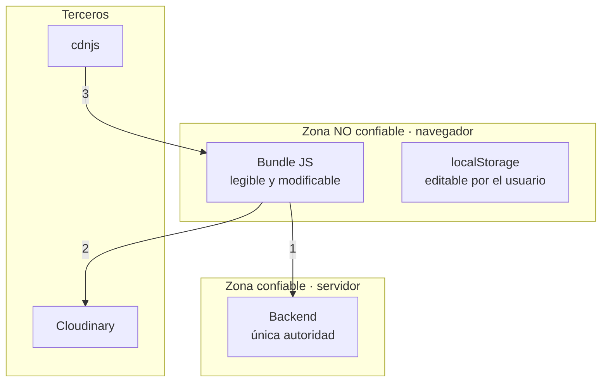

# Modelo de amenazas (STRIDE)

Alcance: el frontend y su relación con el navegador, el backend y los terceros. **No** modela amenazas internas del backend.

## Activos

| Activo | Dónde vive | Sensibilidad |
| --- | --- | --- |
| Token de sesión | `localStorage` | **Alta** — da acceso a toda la API |
| Datos de estudiantes (incluidos menores): nombres, fecha de nacimiento, teléfono, correo, unidad educativa | En tránsito y en pantalla | **Alta** |
| Datos de personal: salarios, comisiones, pagos | En tránsito y en pantalla | **Alta** |
| Datos contables: cuentas, transacciones, deudas | En tránsito y en pantalla | **Alta** |
| Credenciales de acceso | Formulario de login | **Crítica** |
| Borradores de formulario | `localStorage` | Media — pueden contener datos personales |
| Archivos subidos | Cloudinary, URL pública | Media a alta según contenido |
| Preset de Cloudinary | Bundle público | Media |
| URL del backend | Bundle público | Baja |

## Fronteras de confianza

| # | Cruce | Control |
| --- | --- | --- |
| 1 | Frontend → Backend | Cabecera `X-Session-Token`; el backend autoriza |
| 2 | Frontend → Cloudinary | **Ninguno**: preset unsigned público |
| 3 | CDN → Frontend | **Ninguno**: sin SRI, sin CSP |

## Análisis STRIDE

### S — Suplantación (Spoofing)

| ID | Amenaza | Prob. | Impacto | Riesgo | Mitigación actual | Residual |
| --- | --- | --- | --- | --- | --- | --- |
| **T-01** | Un atacante lee las credenciales embebidas del bundle e inicia sesión como administrador | **Alta** — no requiere habilidad | **Crítico** | 🔴 **BLOCKER** | **Ninguna** | 🔴 **Alto**. Ver [SEC-01](frontend-security.md#sec-01) |
| T-02 | Robo del token vía XSS | Baja | Crítico | 🟡 Medio | Sin `dangerouslySetInnerHTML`; React escapa; sin `eval` | 🟡 Medio: entra por terceros (T-03) |
| T-03 | CSS malicioso desde el CDN comprometido | Baja | Alto | 🟡 Medio | Ninguna: sin SRI ni CSP | 🟡 Medio |

### T — Manipulación (Tampering)

| ID | Amenaza | Prob. | Impacto | Riesgo | Mitigación | Residual |
| --- | --- | --- | --- | --- | --- | --- |
| **T-04** | El usuario edita `cpa.session` en `localStorage` y se pone `esSuperUsuario: true` | Alta | **Bajo** | 🟢 Bajo | **El backend es la autoridad**: el frontend solo muestra botones de más | 🟢 Bajo, **siempre que el backend valide**. Si alguna operación confía en el frontend, sube a crítico |
| T-05 | Manipulación de la petición (parámetros, payload) desde DevTools | Alta | Bajo | 🟢 Bajo | Validación del backend | 🟢 Bajo |
| T-06 | Subida de archivos arbitrarios a la cuenta de Cloudinary usando el preset público | Media | Medio | 🟠 **Alto** | Solo límites de tamaño en cliente, evitables | 🟠 Alto. Mitigable **solo** en el panel de Cloudinary. Ver [SEC-04](frontend-security.md#sec-04) |
| T-07 | Clickjacking: embeber la aplicación en un iframe ajeno | Baja | Medio | 🟡 Medio | Ninguna: sin `X-Frame-Options` ni `frame-ancestors` | 🟡 Medio |

### R — Repudio (Repudiation)

| ID | Amenaza | Prob. | Impacto | Riesgo | Mitigación | Residual |
| --- | --- | --- | --- | --- | --- | --- |
| T-08 | Un usuario niega haber realizado una acción | Media | Medio | 🟡 Medio | **Ninguna en el frontend**: sin analítica, sin registro de acciones, sin identificador de correlación | 🟡 Medio. Depende íntegramente de la auditoría del backend |

Agravante: al compartirse la credencial de SEC-01, **cualquier acción registrada como `pablo.admin` es indistinguible entre personas**. La trazabilidad de ese usuario está comprometida hasta que se rote la contraseña.

### I — Divulgación de información (Information disclosure)

| ID | Amenaza | Prob. | Impacto | Riesgo | Mitigación | Residual |
| --- | --- | --- | --- | --- | --- | --- |
| **T-09** | Credenciales legibles en el bundle público | **Alta** | **Crítico** | 🔴 **BLOCKER** | Ninguna | 🔴 Alto |
| T-10 | Datos personales residuales en `localStorage` visibles para el siguiente usuario del equipo | Media | Medio | 🟡 Medio | `clearStoredSession` no borra borradores ni carpetas | 🟡 Medio. Ver [SEC-14](frontend-security.md#sec-14) |
| T-11 | Filtración de topología interna en mensajes de error | Baja | Bajo | 🟢 Bajo | ✅ `sanitizeTechnicalPaths` elimina URLs, métodos y rutas `/api/…` | 🟢 Bajo |
| T-12 | Exposición del código fuente por source maps | Muy baja | Bajo | 🟢 Bajo | ✅ Vite no genera source maps por defecto | 🟢 Bajo |
| T-13 | Archivos de Cloudinary accesibles por URL pública sin autenticación | Media | Medio | 🟡 Medio | Ninguna | 🟡 Medio: usar entrega firmada para documentos sensibles |
| T-14 | `rawUser` persiste el objeto completo del usuario | Media | Bajo | 🟢 Bajo | Ninguna | 🟢 Bajo |

### D — Denegación de servicio (Denial of service)

| ID | Amenaza | Prob. | Impacto | Riesgo | Mitigación | Residual |
| --- | --- | --- | --- | --- | --- | --- |
| T-15 | Autodenegación: filtrar un recurso grande dispara hasta 250 peticiones secuenciales (50 000 / 200) | **Alta** | Medio | 🟠 Alto | Debounces de 900/800 ms; tope de 50 000 filas | 🟠 Alto: es **comportamiento normal**, no un ataque. Ver [../performance/rendering.md](../performance/rendering.md) |
| T-16 | Carga de lookups con hasta 100 000 opciones por campo, en paralelo | Alta | Medio | 🟠 Alto | Ninguna | 🟠 Alto |
| T-17 | Peticiones sin timeout: una conexión colgada bloquea la pantalla indefinidamente | Media | Bajo | 🟡 Medio | Ninguna: sin `timeout` ni `AbortController` | 🟡 Medio |
| T-18 | Abuso del preset de Cloudinary para agotar la cuota de la cuenta | Baja | Medio | 🟡 Medio | Solo límites del panel de Cloudinary | 🟡 Medio |

### E — Elevación de privilegios (Elevation of privilege)

| ID | Amenaza | Prob. | Impacto | Riesgo | Mitigación | Residual |
| --- | --- | --- | --- | --- | --- | --- |
| **T-19** | Uso de la credencial de administrador expuesta | **Alta** | **Crítico** | 🔴 **BLOCKER** | Ninguna | 🔴 Alto |
| T-20 | Acceso por URL directa a pantallas sin comprobación de permisos (`/batch/...`, catálogos, archivos) | Media | Bajo | 🟢 Bajo | El backend autoriza cada operación | 🟢 Bajo **si el backend valida** |
| T-21 | Acceso al módulo de seguridad, que **nunca** se oculta (los 5 recursos tienen `permissions: ""`) | Media | Bajo | 🟢 Bajo | Backend | 🟢 Bajo, con la misma condición |

## Riesgos residuales priorizados

| Prioridad | ID | Acción requerida | Responsable |
| --- | --- | --- | --- |
| 1 | T-01 / T-09 / T-19 | **Rotar la contraseña de `pablo.admin`** y vaciar las credenciales del código | Frontend + administración de la plataforma |
| 2 | T-06 / T-18 | Restringir el preset de Cloudinary: formatos, tamaño, carpeta, moderación | Administrador de Cloudinary |
| 3 | T-15 / T-16 | Rediseñar el filtrado para que se resuelva en servidor | Frontend + backend |
| 4 | T-03 / T-07 | Añadir CSP y `frame-ancestors`; poner SRI o eliminar el CDN | Operaciones + frontend |
| 5 | T-10 / T-14 | Limpiar borradores al cerrar sesión; filtrar `rawUser` | Frontend |
| 6 | T-08 | Definir estrategia de auditoría y correlación con el backend | Producto + backend |

## Supuesto crítico de todo el modelo

> **Este modelo asume que el backend valida y autoriza cada operación de forma independiente.** Los riesgos T-04, T-05, T-20 y T-21 se califican como bajos únicamente por ese supuesto.
>
> **No ha sido verificado en esta auditoría**: no hay acceso al backend ni especificación OpenAPI. Si alguna operación confía en comprobaciones del frontend, esos riesgos pasan a **críticos**.
>
> Verificar este supuesto con el equipo de backend es un requisito previo a cualquier declaración de aptitud productiva. Ver [../reports/production-readiness.md](../reports/production-readiness.md).
